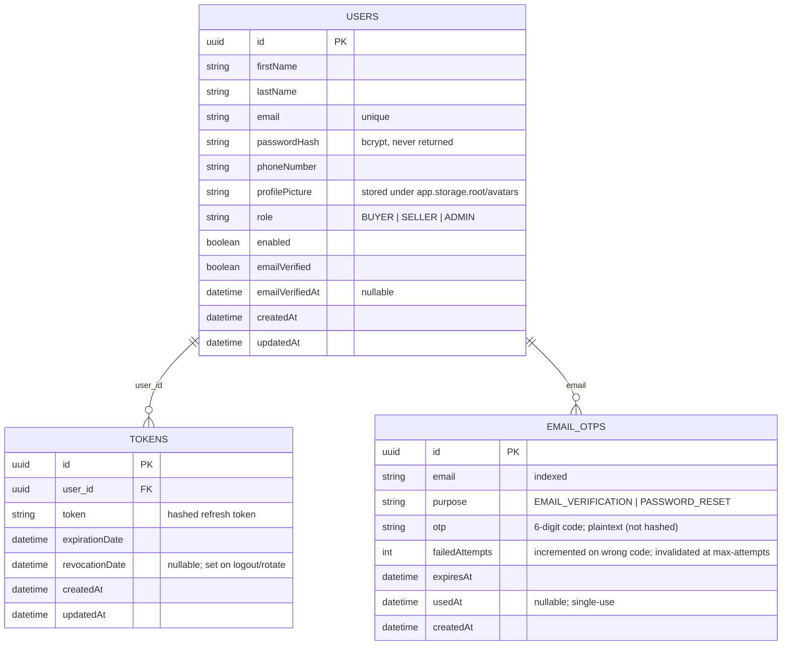
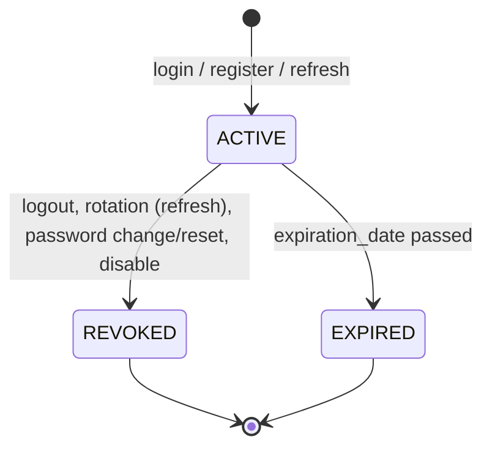
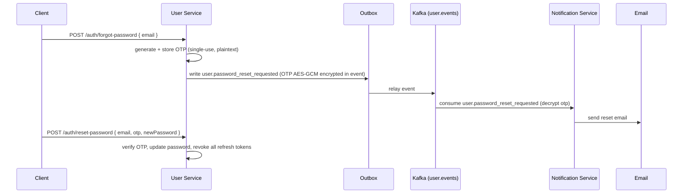
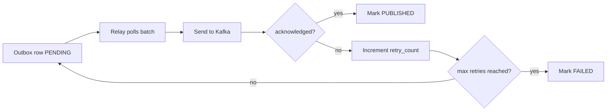

# User Service — Data Model, Kafka Contracts & Workflow

This document describes the user-service contract for Rally in the same style as `payment_service.md`.

It focuses on the publish-driven identity flow:

- User Service owns identity: registration, login, JWT issuance, refresh-token lifecycle.
- User Service persists state in PostgreSQL.
- User Service publishes domain events so Notification Service can send emails.
- User Service uses an outbox table for reliable publishing.
- User Service consumes no topics, so there is **no inbox table** and no message deduplication on intake.

The selected integration model is:

- `user.events` for all outbound events consumed by Notification Service.

User Service is never called by Notification over HTTP for the email flows; Notification
decrypts the OTP delivered inside the outbound Kafka event (§6.3).

---

## 1. User DB Schema

```sql
CREATE EXTENSION IF NOT EXISTS pgcrypto;

-- =====================================================================
-- users
-- =====================================================================

CREATE TABLE users (
    id                UUID PRIMARY KEY DEFAULT gen_random_uuid(),
    first_name        VARCHAR(100) NOT NULL,
    last_name         VARCHAR(100),
    email             VARCHAR(255) NOT NULL,
    password_hash     VARCHAR(255) NOT NULL,      -- bcrypt
    phone_number      VARCHAR(30),
    profile_picture   VARCHAR(1000),              -- served from app.storage.root/avatars
    role              VARCHAR(10) NOT NULL DEFAULT 'BUYER'
                          CHECK (role IN ('BUYER', 'SELLER', 'ADMIN')),
    enabled           BOOLEAN NOT NULL DEFAULT TRUE,
    email_verified    BOOLEAN NOT NULL DEFAULT FALSE,
    email_verified_at TIMESTAMPTZ NULL,
    created_at        TIMESTAMPTZ NOT NULL DEFAULT now(),
    updated_at        TIMESTAMPTZ NOT NULL DEFAULT now()
);

CREATE UNIQUE INDEX uq_users_email ON users (email);
CREATE INDEX idx_users_role ON users (role);

-- =====================================================================
-- tokens  (refresh tokens only, stored hashed)
-- =====================================================================

CREATE TABLE tokens (
    id               UUID PRIMARY KEY DEFAULT gen_random_uuid(),
    user_id          UUID NOT NULL REFERENCES users(id),
    token            VARCHAR(255) NOT NULL,       -- hashed value
    expiration_date  TIMESTAMPTZ NOT NULL,
    revocation_date  TIMESTAMPTZ NULL,
    created_at       TIMESTAMPTZ NOT NULL DEFAULT now(),
    updated_at       TIMESTAMPTZ NOT NULL DEFAULT now()
);

CREATE UNIQUE INDEX uq_tokens_token ON tokens (token);
CREATE INDEX idx_tokens_user_id ON tokens (user_id);

-- =====================================================================
-- email_otps  (6-digit OTP for email verification + password reset)
-- =====================================================================

CREATE TABLE email_otps (
    id               UUID PRIMARY KEY DEFAULT gen_random_uuid(),
    email            VARCHAR(255) NOT NULL,
    purpose          VARCHAR(20) NOT NULL
                         CHECK (purpose IN ('EMAIL_VERIFICATION', 'PASSWORD_RESET')),
    otp              VARCHAR(6) NOT NULL,              -- 6-digit code (plaintext, not hashed)
    failed_attempts  INTEGER NOT NULL DEFAULT 0,       -- failed verify attempts before invalidation
    expires_at       TIMESTAMPTZ NOT NULL,
    used_at          TIMESTAMPTZ NULL,                 -- set on successful verify/reset
    created_at       TIMESTAMPTZ NOT NULL DEFAULT now()
);

CREATE INDEX idx_email_otps_email ON email_otps (email);
CREATE INDEX idx_email_otps_expires ON email_otps (expires_at);

-- =====================================================================
-- outbox_messages
-- =====================================================================

CREATE TABLE outbox_messages (
    message_id      UUID PRIMARY KEY,
    aggregate_id    UUID NOT NULL,
    aggregate_type  VARCHAR(100) NOT NULL,
    topic           VARCHAR(100) NOT NULL,
    message_key     VARCHAR(255),
    message_type    VARCHAR(100) NOT NULL,
    correlation_id  UUID,
    causation_id    VARCHAR(255),
    trace_id        VARCHAR(64),
    payload         JSONB NOT NULL,
    headers         JSONB,
    status          VARCHAR(20) NOT NULL DEFAULT 'PENDING',
    retry_count     INTEGER NOT NULL DEFAULT 0,
    max_retries     INTEGER NOT NULL DEFAULT 5,
    created_at      TIMESTAMPTZ NOT NULL DEFAULT now(),
    published_at    TIMESTAMPTZ,
    last_error      TEXT
);

CREATE INDEX idx_outbox_status_created_at
    ON outbox_messages (status, created_at);

CREATE INDEX idx_outbox_topic
    ON outbox_messages (topic);

CREATE INDEX idx_outbox_aggregate
    ON outbox_messages (aggregate_id);

CREATE INDEX idx_outbox_correlation
    ON outbox_messages (correlation_id);
```

---

## 2. User Domain Model

### 2.1 `User`

The `User` aggregate owns the identity of a single account.

Key fields:

- `id`
- `firstName`, `lastName`
- `email` (unique, the login identifier)
- `passwordHash`
- `phoneNumber`
- `profilePicture` (implemented — avatar upload via `POST /auth/me/avatar`)
- `role` (`BUYER` | `SELLER` | `ADMIN`)
- `enabled`
- `emailVerified`, `emailVerifiedAt`
- `createdAt`, `updatedAt`

Key behaviors:

- `register(...)`
- `verifyEmail(...)`
- `updateProfile(...)` / `applyProfile(...)`
- `changePassword(...)`
- `setProfilePicture(...)`
- `changeRole(...)`
- `enable()` / `disable()`
- `softDelete()`

### 2.2 `RefreshToken`

Represents a single-use refresh-token record.

Key fields:

- `id`
- `userId`
- `token` (stored hashed)
- `expirationDate`
- `revocationDate`

Rotated on every `POST /auth/refresh`: the presented token is revoked and a new pair is issued.

### 2.3 `EmailOtp`

Represents a short-lived 6-digit code for email verification or password reset.

Key fields:

- `id`
- `email`
- `purpose` (`EMAIL_VERIFICATION` | `PASSWORD_RESET`)
- `otp` (plaintext, not hashed)
- `failedAttempts` (incremented on wrong code; invalidated after `app.otp.max-attempts`)
- `expiresAt`
- `usedAt` (single-use)

### 2.4 `OutboxMessage`

Stores domain events that will later be published to Kafka by the outbox relay.

### 2.5 ERD overview



### 2.6 Scope — user stories

**Registration & Login**

- As a visitor, I want to register as a buyer or seller so I can use the platform.
- As a new registrant, I want to confirm my email with an OTP so my account is verified and I can log in.
- As a registrant who missed the OTP, I want to request a new verification OTP.
- As a registered user, I want to log in with my email and password so I can authenticate.
- As a logged-in user, I want to stay authenticated after my access token expires, by refreshing with a refresh token.

**Session & Security**

- As a user, I want to log out so my tokens are revoked.
- As a user, I want to change my password (knowing my current password).
- As a user who forgot my password, I want to request a reset OTP by email and set a new password.
- As a user, I want any sensitive action (password change, reset, role change) to revoke my existing sessions.

**Profile**

- As a user, I want to see my own profile (name, email, phone, joined date).
- As a user, I want to update my profile fields.
- As a user, I want to change my profile picture (`POST /auth/me/avatar`).

**Administration**

- As an admin, I want to change a user's role between buyer/seller/admin.
- As an admin, I want to list users and ban/activate (enable/disable) them.

---

## 3. User & Token Status Machine

### 3.1 Refresh-token lifecycle



Practical meaning:

- `ACTIVE` — usable until `expirationDate`.
- `REVOKED` — explicitly invalidated (logout, refresh rotation, password change/reset, admin disable); rejected with `InvalidRefreshTokenException`.
- `EXPIRED` — past `expirationDate`; rejected.

Rotation rule: each successful `POST /auth/refresh` revokes the presented token and issues a new pair (access + refresh).

### 3.2 User state

The `User` carries two independent boolean flags:

- `enabled` — a disabled user cannot log in or refresh; existing access tokens remain valid only until expiry.
- `emailVerified` — a newly registered account is created with `emailVerified = false` (unless `app.auto-confirm-email = true`) and cannot log in until the OTP is confirmed.

Deletion is a soft-delete/anonymization so orders, payments, and participations referencing `userId` keep their data.

---

## 4. Kafka Topic Contracts

User Service publishes events that Notification Service consumes. User Service consumes no topics.

### 4.1 Message envelope rule

Context (correlation & tracing) travels through the system as **incoming HTTP/Kafka headers**, and is carried into each outbound event's envelope. User Service no longer emits a `X-Causation-Id` or `X-Trace-Id` header — causation is dropped and tracing uses the W3C `traceparent` propagated by Micrometer/OpenTelemetry.

**Incoming context headers** (from HTTP request or Kafka record):

| Header | Required | Purpose | Producer |
|---|---|---|---|
| `traceparent` | yes | W3C distributed-tracing context | OpenTelemetry propagator (Micrometer Tracing) |
| `X-Correlation-Id` | yes | Links the message to the business flow | Client / gateway (echoed back by `CorrelationIdFilter`) |

**Outbound message headers** (stored in `outbox.headers` and emitted on the Kafka record):

| Header | Required | Purpose |
|---|---|---|
| `X-Id` | yes | Unique message identifier used for message dedupe |
| `X-Type` | yes | Message type and operation selector |
| `X-Correlation-Id` | yes | Links the message to the business flow (came in via the request, reused) |

The stored outbox row also persists `trace_id` (the OpenTelemetry trace id) and `causation_id`; on relay the relay reparents the OTLP trace span so the resulting Kafka record carries the W3C `traceparent` header. Neither `trace_id` nor `causation_id` is emitted as an `X-*` header.

The payload must not contain any of those fields.

For outbound events, the message type is selected by `X-Type`, not by a payload field.

Recommended `X-Type` values for outbound events:

- `User.Registered`
- `User.EmailVerificationRequested`
- `User.PasswordResetRequested`

### 4.2 User Service -> Notification Service

| Topic | Purpose | `X-Type` selector |
|---|---|---|
| `user.events` | Welcome email for a new account | `X-Type = User.Registered` |
| `user.events` | Verification OTP email | `X-Type = User.EmailVerificationRequested` |
| `user.events` | Password-reset OTP email | `X-Type = User.PasswordResetRequested` |

### 4.3 No inbound topics

There are **no inbound topics** — User Service listens to nothing, therefore there is
no inbox table, no inbox deduplication, and no inbox replay.

> **Tradeoff (accepted):** email PII lives in the outbox, the topic, and dead-letter
> queues. Keep the topic Notification-only, short retention, and do not log payloads. If
> other consumers subscribe later, split topics or fall back to `userId`-only events.

---

## 5. Message Payload Schemas

### 5.1 `user.registered`

Published when an account is created.

Headers:

| Header | Example |
|---|---|
| `X-Type` | `User.Registered` |
| `X-Id` | `uuid` |
| `X-Correlation-Id` | `uuid` (echoed from the registering request) |
| `traceparent` | W3C trace context (propagated by Micrometer/OTLP) |

Payload:

```json
{
  "userId": "uuid",
  "email": "alex.j@example.com",
  "role": "BUYER",
  "createdAt": "2026-07-30T10:15:00Z"
}
```

### 5.2 `user.email_verification_requested`

Published when a verification OTP is generated (on registration, or on resend).

Headers:

| Header | Example |
|---|---|
| `X-Type` | `User.EmailVerificationRequested` |
| `X-Id` | `uuid` |
| `X-Correlation-Id` | `uuid` (echoed from the registering/resend request) |
| `traceparent` | W3C trace context (propagated by Micrometer/OTLP) |

Payload:

```json
{
  "userId": "uuid",
  "email": "alex.j@example.com",
  "otp": "<AES-GCM-encrypted 6-digit code>"
}
```

`otp` is the **AES-GCM encrypted** code (JDK `AES/GCM/NoPadding` + `PBKDF2WithHmacSHA256`, key derived from `app.otp.encryption.password`/`salt`). Notification Service decrypts it to deliver the email. The OTP is **not** sent in the clear over Kafka — see §6.3.

### 5.3 `user.password_reset_requested`

Published when a password-reset OTP is generated (`POST /auth/forgot-password`).

Headers:

| Header | Example |
|---|---|
| `X-Type` | `User.PasswordResetRequested` |
| `X-Id` | `uuid` |
| `X-Correlation-Id` | `uuid` (echoed from the forgot-password request) |
| `traceparent` | W3C trace context (propagated by Micrometer/OTLP) |

Payload:

```json
{
  "userId": "uuid",
  "email": "alex.j@example.com",
  "otp": "<AES-GCM-encrypted 6-digit code>"
}
```

`otp` is the **AES-GCM encrypted** code, keyed from `app.otp.encryption.password`/`salt` (same scheme as §5.2). Notification Service decrypts it to deliver the reset email.

### 5.4 Required Headers

| Header | Purpose |
|---|---|
| `X-Id` | Unique message id for message dedupe |
| `X-Type` | Event or command type |
| `X-Correlation-Id` | Correlates the event with the business flow |
| `traceparent` | W3C distributed-tracing identifier |

> `X-Causation-Id` and `X-Trace-Id` are **not** emitted by User Service. Causation is no longer tracked as a message header, and tracing relies on the standard W3C `traceparent` propagated by Micrometer/OpenTelemetry.

The outbox persistence model mirrors these headers:

- `message_id` stores `X-Id`
- `correlation_id` stores `X-Correlation-Id`
- `causation_id` stores the triggering message id (informational; **not** emitted as a header)
- `trace_id` stores the OpenTelemetry trace id (replayed as W3C `traceparent` on relay)

### 5.5 Payload rule

The payload for every message must contain only business data.

The payload must not contain:

- message id
- correlation id
- trace id
- type

Those belong only in headers.

### 5.6 OTP storage rule

The OTP is stored **plaintext** in `email_otps` (not hashed), so it can be compared on verification. It is **never put on Kafka in the clear** — each outbound event carries the code **AES-GCM encrypted** (§5.2), and Notification decrypts it to deliver the email. Compensating controls:

- values are short-lived (`app.otp.expiration-minutes`, default 3) and single-use (consumed on verification)
- encrypted in transit on the topic via AES-GCM (key derived from `app.otp.encryption.password`/`salt`)
- attempt-limited (`app.otp.max-attempts`, default 5) via `failed_attempts`
- purged/revoked after use or expiry/resend

---

## 6. Flows

### 6.1 Registration & Email Verification

```mermaid
sequenceDiagram
    participant C as Client
    participant U as User Service
    participant X as Outbox
    participant K as Kafka (user.events)
    participant N as Notification Service
    participant E as Email

    C->>U: POST /auth/register
    U->>U: create user (emailVerified=false), generate + store OTP (plaintext)
    U->>X: write user.registered + user.email_verification_requested (same tx; OTP AES-GCM encrypted in event)
    X->>K: relay both events
    K->>N: consume user.email_verification_requested (decrypt otp)
    N->>E: send verification email
    C->>U: POST /auth/verify-email { email, otp }
    U->>U: verify OTP, set emailVerified=true, issue token pair (200)
```

Typical sequence:

1. Client registers; User Service creates the account with `emailVerified = false`, generates a 6-digit OTP, and stores it (plaintext) in `email_otps`.
2. User Service writes `user.registered` and `user.email_verification_requested` to the outbox in the same transaction; the OTP is AES-GCM encrypted before being placed in the event payload.
3. The outbox relay publishes both events to `user.events`.
4. Notification Service consumes the verification event and decrypts the OTP.
5. Notification Service emails the OTP.
6. Client submits the OTP; User Service verifies it, sets `emailVerified = true`, and returns a token pair.

### 6.2 Password Reset



### 6.3 OTP Delivery (encrypted in-event)

The OTP travels inside the outbound event payload, **encrypted** so it never crosses Kafka in plaintext:

- On generation (register / resend / forgot-password) the plaintext code is stored in `email_otps.otp`.
- The relayed Kafka event carries `otp` = AES-GCM ciphertext (§5.2/§5.3), produced by `OtpEncryptor` (`AES/GCM/NoPadding` + `PBKDF2WithHmacSHA256`, keyed from `app.otp.encryption.password`/`salt`).
- Notification Service decrypts the payload to obtain the code and sends the email.

Rules:

- The shared encryption key must be configured on both User Service and Notification Service; if User Service is not configured it logs an error and **skips delivery** of the OTP event.
- Redelivery is safe: decrypting the same ciphertext yields the same OTP.
- The code remains single-use and short-lived server-side (`expires_at`, consumed via `used_at`).

### 6.4 Outbox Relay



---

## 7. API Surface

The HTTP API is the primary path. All external traffic goes through the API gateway.

### 7.1 Auth

#### 7.1.1 `POST /auth/register`

Public. Create an account.

**Request**
```json
{
  "firstName": "Alex",
  "lastName": "Johnson",
  "email": "alex.j@example.com",
  "password": "S3cret!",
  "phoneNumber": "+1 555 019 2834",
  "role": "BUYER"
}
```
`role` is `BUYER` or `SELLER` (`ADMIN` is not assignable at registration). `firstName`, `email`, `password` are required.

Creates the account with `emailVerified = false` and sends a 6-digit verification OTP to the email (unless `app.auto-confirm-email = true`, §7.7).

**Response — 201**
```json
{
  "id": "b3f1...",
  "firstName": "Alex",
  "lastName": "Johnson",
  "email": "alex.j@example.com",
  "phoneNumber": "+1 555 019 2834",
  "role": "BUYER",
  "enabled": true,
  "createdAt": "2026-07-30T10:15:00Z"
}
```

**Errors**
| Status | Cause |
|---|---|
| 409 | `UserAlreadyExistsException` — email already registered |
| 400 | missing/invalid fields, invalid role |

#### 7.1.2 `POST /auth/login`

Public. Authenticate and issue tokens.

**Request**
```json
{
  "email": "alex.j@example.com",
  "password": "S3cret!"
}
```

**Response — 200**
```json
{
  "accessToken": "eyJhbGciOi...",
  "refreshToken": "r_...",
  "expiresIn": 900,
  "user": {
    "id": "b3f1...",
    "firstName": "Alex",
    "lastName": "Johnson",
    "email": "alex.j@example.com",
    "role": "BUYER"
  }
}
```
`expiresIn` is `app.security.access-token-seconds` (§7.7).

**JWT claims contract:** `sub` (userId), `role`, `name`, `firstName`, `lastName`, `email`, `phoneNumber`, `iat`, `exp`. Issued by the local `JwtTokenService` (RS256, RSA private key from `app.security.jwt.*`). The UI stores the access token as `authToken` in localStorage; `authInterceptor` sends it as `Authorization: Bearer <token>` on every call. The gateway validates the token and forwards the decoded identity to services as `X-User-Id`, `X-User-Role`, `X-User-Scope` headers (§7.3).

**Errors**
| Status | Cause |
|---|---|
| 401 | `InvalidCredentialsException` — wrong email/password, or account disabled (same message, enumeration-safe) |
| 403 | `EmailNotVerifiedException` — account not verified |

#### 7.1.3 `POST /auth/refresh`

Public (refresh token in body). Rotate the refresh token.

**Request**
```json
{ "refreshToken": "r_..." }
```

**Response — 200**
```json
{
  "accessToken": "eyJhbGciOi...",
  "refreshToken": "r_new...",
  "expiresIn": 900
}
```

**Errors**
| Status | Cause |
|---|---|
| 401 | `InvalidRefreshTokenException` — unknown, expired, or revoked token |

#### 7.1.4 `POST /auth/logout`

Authenticated. Revoke the caller's active refresh token(s).

**Request**
```json
{ "refreshToken": "r_..." }
```

**Response — 204** — no body.

#### 7.1.5 `GET /auth/me`

Authenticated. Current user profile (feeds the header and profile-summary UI).

**Response — 200**
```json
{
  "id": "b3f1...",
  "name": "Alex Johnson",
  "firstName": "Alex",
  "lastName": "Johnson",
  "email": "alex.j@example.com",
  "phoneNumber": "+1 555 019 2834",
  "profilePicture": "/uploads/avatars/b3f1....png",
  "role": "BUYER",
  "enabled": true,
  "emailVerified": true,
  "emailVerifiedAt": "2026-07-30T10:15:00Z",
  "createdAt": "2026-07-30T10:15:00Z"
}
```

#### 7.1.6 `POST /auth/change-password`

Authenticated. Change password knowing the current one. Revokes all the user's refresh tokens on success.

**Request**
```json
{
  "currentPassword": "S3cret!",
  "newPassword": "N3w-S3cret!"
}
```

**Response — 204** — no body.

**Errors**
| Status | Cause |
|---|---|
| 400 | `newPassword` fails the password policy (§7.7), or `currentPassword` mismatch (`InvalidCurrentPassword`) |
| 404 | no user with this `id` |

#### 7.1.7 `POST /auth/resend-verification-otp`

Public. Generate a new 6-digit verification OTP for the given email (for accounts that registered but never verified). Always returns 202 (even for unknown/verified emails) to avoid user enumeration.

**Request**
```json
{ "email": "alex.j@example.com" }
```

**Response — 202** — no body. The OTP is sent to the email, not returned in the response.

#### 7.1.8 `POST /auth/verify-email`

Public. Confirm the email with the OTP. On success, sets `emailVerified` and `emailVerifiedAt` and **issues a token pair** (the caller is logged in immediately).

**Request**
```json
{
  "email": "alex.j@example.com",
  "otp": "482913"
}
```

**Response — 200** — a `LoginResponse` (same shape as §7.1.2), i.e. `{ accessToken, refreshToken, expiresIn, user }`.

**Errors**
| Status | Cause |
|---|---|
| 401 | invalid, expired, exhausted, or already-used OTP for this email |

#### 7.1.9 `POST /auth/forgot-password`

Public. Generate a **6-digit OTP** for the given email and deliver it (via Notification Service / email provider). Always returns 202 (even for unknown emails) to avoid user enumeration. Rate-limited by `app.otp.resend-cooldown-seconds` (enforced in `PasswordResetService.requestPasswordReset`).

**Request**
```json
{ "email": "alex.j@example.com" }
```

**Response — 202** — no body. The OTP is sent to the email, not returned in the response.

#### 7.1.10 `POST /auth/reset-password`

Public. Set a new password using the emailed OTP. Single-use; revokes all the user's refresh tokens on success.

**Request**
```json
{
  "email": "alex.j@example.com",
  "otp": "482913",
  "newPassword": "N3w-S3cret!"
}
```

**Response — 204** — no body.

**Errors**
| Status | Cause |
|---|---|
| 401 | invalid, expired, exhausted, or already-used OTP for this email |

#### 7.1.11 `POST /auth/verify-email-otp`

Public. Read-only pre-check of a verification OTP before the UI moves to the next step. Does **not** consume the code.

**Request**
```json
{
  "email": "alex.j@example.com",
  "otp": "482913"
}
```

**Response — 200**
```json
{ "valid": true }
```

**Errors**
| Status | Cause |
|---|---|
| 401 | invalid, expired, exhausted, or already-used OTP for this email |

#### 7.1.12 `POST /auth/verify-reset-otp`

Public. Read-only pre-check of a password-reset OTP before the UI shows the new-password step. Does **not** consume the code.

**Request**
```json
{
  "email": "alex.j@example.com",
  "otp": "482913"
}
```

**Response — 200**
```json
{ "valid": true }
```

**Errors**
| Status | Cause |
|---|---|
| 401 | invalid, expired, exhausted, or already-used OTP for this email |

#### 7.1.13 `POST /auth/me/avatar`

Authenticated. Upload the caller's profile picture.

**Request** — `multipart/form-data`, field `file` (SVG/PNG/JPG only, max 5 MB).

**Response — 201**
```json
{ "path": "/uploads/avatars/b3f1....png" }
```

Avatars are stored under `app.storage.root/avatars` and served statically by the service at `/uploads/**` (`WebConfig` resource handler).

### 7.2 Users

#### 7.2.1 `GET /users/{id}`

Admin only. Get a user's profile.

**Response — 200** — same shape as `GET /auth/me`.

**Errors**
| Status | Cause |
|---|---|
| 403 | requester is not an admin |
| 404 | no user with this `id` |

#### 7.2.2 `PATCH /users/{id}`

Admin only. Update a user's profile fields.

**Request** (all optional; only provided fields are updated)
```json
{
  "firstName": "Alex",
  "lastName": "Johnson",
  "phoneNumber": "+1 555 019 2834"
}
```

**Response — 200** — updated `UserResponse`.

**Errors**
| Status | Cause |
|---|---|
| 403 | requester is not an admin |
| 404 | no user with this `id` |
| 400 | invalid field value |

#### 7.2.3 `PATCH /users/{id}/role`

Admin only. Change role. Revokes the user's refresh tokens on change.

**Request**
```json
{ "role": "SELLER" }
```

**Response — 200** — updated `UserResponse`.

**Errors**
| Status | Cause |
|---|---|
| 403 | `RoleChangeNotAllowedException` — non-admin, or disallowed transition |
| 404 | no user with this `id` |

#### 7.2.4 `GET /users`

Admin only. Paginated user list.

**Query params:** `page` (default 1), `limit` (default 20), `search` (optional, name/email), `types` (optional, `BUYER` | `SELLER` | `ADMIN`, repeatable), `statuses` (optional, e.g. `ACTIVE`/`BANNED`, repeatable).

**Response — 200**
```json
{
  "items": [
    {
      "id": "b3f1...",
      "name": "Alex Johnson",
      "email": "alex.j@example.com",
      "avatarUrl": null,
      "joinedAt": "2026-07-30T10:15:00Z",
      "status": "ACTIVE",
      "type": "BUYER"
    }
  ],
  "page": 1,
  "limit": 20,
  "total": 1
}
```

#### 7.2.5 `GET /users/sellers`

Admin only. Paginated seller list.

**Query params:** `page` (default 1), `limit` (default 20), `search` (optional, name/email).

**Response — 200** — `PageResponse<SellerListItem>` with items of shape `{ id, name, email, avatarUrl, joinedAt }`.

#### 7.2.6 `PATCH /users/{id}/ban`

Admin only. Disable a user. Cannot ban an `ADMIN`.

**Response — 204** — no body.

**Errors**
| Status | Cause |
|---|---|
| 403 | requester is not an admin, or target is an `ADMIN` |
| 404 | no user with this `id` |

#### 7.2.7 `PATCH /users/{id}/activate`

Admin only. Re-enable a banned/disabled user.

**Response — 204** — no body.

**Errors**
| Status | Cause |
|---|---|
| 403 | requester is not an admin |
| 404 | no user with this `id` |

#### 7.2.8 `GET /users/{id}/roles`

Admin only. Get the current role of a user.

**Response — 200**
```json
{ "id": "b3f1...", "role": "SELLER" }
```

#### 7.2.9 `GET /users/sellers/{id}`

Admin only. Get a seller as a `SellerListItem`.

**Response — 200**
```json
{
  "id": "b3f1...",
  "name": "Alex Johnson",
  "email": "alex.j@example.com",
  "avatarUrl": null,
  "joinedAt": "2026-07-30T10:15:00Z"
}
```

**Errors**
| Status | Cause |
|---|---|
| 403 | requester is not an admin |
| 404 | no user with this `id` |

#### 7.2.10 `GET /users/batch`

Internal. Resolve a batch of `userId`s to `UserSummary` records (for consumers that need names/roles).

**Request** — body is a JSON array of UUIDs.
```json
["b3f1...", "c4d2..."]
```

**Response — 200**
```json
[
  { "id": "b3f1...", "firstName": "Alex", "lastName": "Johnson", "email": "alex.j@example.com", "role": "BUYER" }
]
```

### 7.3 Gateway identity propagation

The API gateway is the trusted edge. On every request it validates the JWT, **strips any client-supplied identity headers**, and injects the decoded claims so services don't re-parse the token:

| Header | Source claim | Purpose |
|---|---|---|
| `X-User-Id` | `sub` | caller's `userId` |
| `X-User-Role` | `role` | caller's role |
| `X-User-Scope` | `scope` (if present) | caller's scopes |

Public auth endpoints (`/auth/register`, `/auth/login`, `/auth/refresh`, verification and reset OTP endpoints) have no caller identity — no headers are injected. Services must not be reachable outside the gateway (private network), since they trust these headers.

### 7.4 Error Contract

Reuse the `rally-common` vocabulary unchanged. Domain exceptions in use:

| Exception | HTTP | When |
|---|---|---|
| `UserAlreadyExistsException` | 409 | register with an existing email |
| `InvalidCredentialsException` | 401 | login with wrong email/password, or disabled account |
| `InvalidRefreshTokenException` | 401 | refresh with unknown, expired, or revoked token |
| `EmailNotVerifiedException` | 403 | login with an unverified account (local to rally-auth) |
| `RoleChangeNotAllowedException` | 403 | non-admin, or disallowed role transition |
| `DisabledAccountException` | 403 | refresh with a disabled account |
| `InvalidOtpException` | 401 | invalid/expired/exhausted OTP during verify/reset |
| `InvalidCurrentPassword` | 400 | wrong current password on `change-password` |

All errors return the shared `ErrorResponse` shape (timestamp, status, title, message, path) via `GlobalExceptionHandler`.

**Exception placement rule**

- **Prefer existing shared exceptions** (`NotFoundException`, `BadRequestException`, `ConflictException`, `UnauthorizedException`, ...) — no new classes for common cases.
- **New domain exceptions go into `rally-common` under `domain/auth/`** when another service or the gateway must recognize them (e.g. token exceptions) — auth is platform-wide, so Order/Payment/Gateway must treat an unverified user identically.
- **Service-local exceptions are acceptable** only for implementation-private edge cases that no other service needs to interpret — and they must extend `BaseException` so the shared `GlobalExceptionHandler` still maps them to `ErrorResponse` unchanged. `EmailNotVerifiedException`, `RoleChangeNotAllowedException`, `DisabledAccountException`, `InvalidOtpException`, and `InvalidCurrentPassword` currently live locally in rally-auth.

### 7.5 DTOs (Java records)

```java
public record RegisterRequest(
    String firstName,   // @NotBlank
    String lastName,    // optional
    String email,       // @NotBlank @Email
    String password,    // @NotBlank
    String phoneNumber, // optional
    String role         // @Pattern "BUYER|SELLER" (String, not enum)
) {}

public record LoginRequest(String email, String password) {}

public record TokenPairResponse(
    String accessToken,
    String refreshToken,
    long expiresIn
) {}

public record LoginResponse(
    String accessToken,
    String refreshToken,
    long expiresIn,
    UserSummary user          // id, firstName, lastName, email, role
) {}

public record RegisterResponse(
    UUID id,
    String firstName,
    String lastName,
    String email,
    String phoneNumber,
    Role role,
    boolean enabled,
    Instant createdAt
) {}

public record VerifyEmailRequest(String email, String otp) {}

public record VerifyOtpRequest(String email, String otp) {}          // pre-check endpoints

public record ResendVerificationRequest(String email) {}

public record ForgotPasswordRequest(String email) {}

public record ResetPasswordRequest(String email, String otp, String newPassword) {}

public record RefreshRequest(String refreshToken) {}

public record LogoutRequest(String refreshToken) {}

public record ChangePasswordRequest(String currentPassword, String newPassword) {}

public record UpdateProfileRequest(
    Optional<String> firstName,
    Optional<String> lastName,
    Optional<String> phoneNumber
) {}

public record UpdateRoleRequest(String role) {}  // @Pattern "BUYER|SELLER|ADMIN"

public record UserResponse(
    UUID id,
    String name,
    String firstName,
    String lastName,
    String email,
    String phoneNumber,
    String profilePicture,
    Role role,
    boolean enabled,
    boolean emailVerified,
    Instant emailVerifiedAt,
    Instant createdAt
) {}

public record UserSummary(
    UUID id,
    String firstName,
    String lastName,
    String email,
    Role role
) {}

public record PageResponse<T>(
    List<T> items,
    int page,
    int limit,
    long total
) {}  // used for list endpoints (UserListItem / SellerListItem)

public record UserListItem(
    UUID id, String name, String email, String avatarUrl,
    Instant joinedAt, String status, String type
) {}

public record SellerListItem(
    UUID id, String name, String email, String avatarUrl, Instant joinedAt
) {}

public record UserRoleResponse(UUID id, Role role) {}

public record OtpVerificationResponse(boolean valid) {}

public record AvatarUploadResponse(String path) {}
```

`Role` enum: `BUYER`, `SELLER`, `ADMIN`.

### 7.6 Reliability and Ops

| Method | Path | Purpose |
|---|---|---|
| `GET` | `/actuator/health` | Application and dependency health |
| `GET` | `/actuator/info` | Build and deployment metadata |
| `GET` | `/actuator/metrics` | Runtime metrics |

> Outbox relay retry happens automatically in-process: `OutboxRelay` polls every `outbox.relay.poll-interval-ms` (default 1000 ms), publishes a batch of up to `outbox.relay.batch-size` (default 100), and retries up to `max_retries` (default 5) before marking the row `FAILED`.

### 7.7 Configuration

All behavior knobs are externalized via Spring `application.yml` (`app.*`). Dev/test override them; production uses the secure defaults below.

```yaml
app:
  auto-confirm-email: false          # dev/test convenience
  email:
    enabled: true
  otp:
    length: 6
    expiration-minutes: 3
    max-attempts: 5
    resend-cooldown-seconds: 60
    encryption:
      password: <secret>
      salt: <secret>
  security:
    access-token-seconds: 900
    refresh-token-days: 30
    jwt:
      private-key: <PEM/RSA>
      public-key: <PEM/RSA>
  storage:
    root: ./uploads
  password:
    min-length: 8
    max-length: 64
    require-uppercase: true
    require-lowercase: true
    require-digit: true
    require-special: true
```

| Property | Default | Effect |
|---|---|---|
| `app.auto-confirm-email` | `false` | `true` → registration immediately sets `email_verified = true` and no verification OTP is generated/sent (dev/test only) |
| `app.email.enabled` | `true` | `false` → email events (§4) are not published; OTPs are not deliverable |
| `app.otp.length` | `6` | number of digits in the OTP |
| `app.otp.expiration-minutes` | `3` | OTP validity window (`email_otps.expires_at`) |
| `app.otp.max-attempts` | `5` | failed verifications before the OTP is invalidated (`failed_attempts`) |
| `app.otp.resend-cooldown-seconds` | `60` | minimum interval between OTP generations for the same email |
| `app.otp.encryption.password` | — | AES-GCM key-password for encrypting the OTP in outbound events (§6.3); must match Notification Service |
| `app.otp.encryption.salt` | — | AES-GCM salt for the PBKDF2 key derivation (§6.3) |
| `app.security.access-token-seconds` | `900` | access token `exp` (returned as `expiresIn`) |
| `app.security.refresh-token-days` | `30` | refresh-token lifetime (`tokens.expiration_date`) |
| `app.security.jwt.private-key` / `public-key` | — | RSA key pair used by `JwtTokenService` to sign/verify access tokens (RS256) |
| `app.storage.root` | `./uploads` | root directory for stored profile pictures (served at `/uploads/**`) |
| `app.password.min-length` | `8` | minimum password length |
| `app.password.max-length` | `64` | maximum password length (bcrypt hashes at most 72 bytes) |
| `app.password.require-uppercase` | `true` | at least one `A-Z` character |
| `app.password.require-lowercase` | `true` | at least one `a-z` character |
| `app.password.require-digit` | `true` | at least one `0-9` character |
| `app.password.require-special` | `true` | at least one special character (`!@#$%^&*...`) |

---

## 8. User Service Responsibilities

The user service owns:

- identity and registration
- JWT issuance and refresh-token lifecycle
- email OTP generation and verification
- outbox publishing of domain events
- user profile data
- role management and ban/activate (enable/disable)
- profile-picture upload, storage, and serving

The user service does not own:

- email delivery (Notification Service sends the emails)
- participations, deals, orders, or payments
- inventory reservation
- payment state transitions

Profile picture handling (upload, storage, serving) is **implemented**: `POST /auth/me/avatar` stores the file under `app.storage.root/avatars` (SVG/PNG/JPG, max 5 MB) and the service serves it at `/uploads/**`.

---

## 9. Notes on Naming

For Rally, keep the contract names aligned with Notification Service.

### Topic Names

- `user.events`

### Outbound Message `X-Type` Values

- `User.Registered`
- `User.EmailVerificationRequested`
- `User.PasswordResetRequested`

There are **no inbound message `X-Type` values** — User Service is publish-only.

Keep topic names lowercase and domain-oriented. Keep `X-Type` values as the message contract identifiers, and keep enum casing only in code-level models where needed.

---

## 10. Summary

The user service is a publish-driven, PostgreSQL-backed, outbox-protected identity service.

Its job is to:

1. own registration, login, and the refresh-token lifecycle,
2. generate and verify email OTPs,
3. store the outcome safely,
4. publish canonical user events for Notification Service,
5. expose the HTTP API through the gateway for the UI,
6. and resolve identity internally for downstream services (`GET /users/batch`).