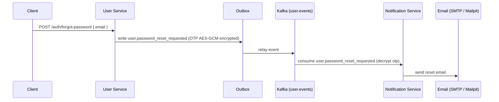
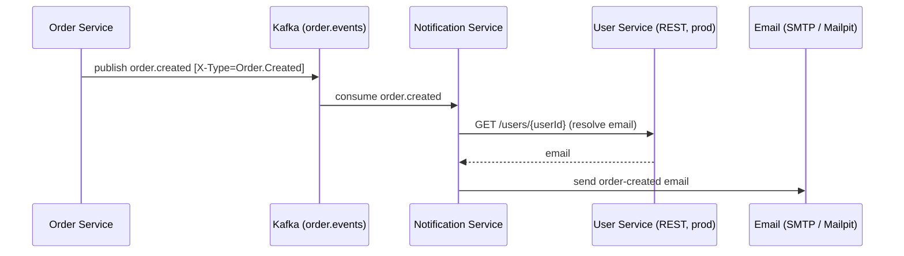
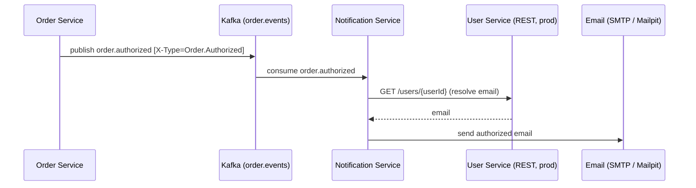
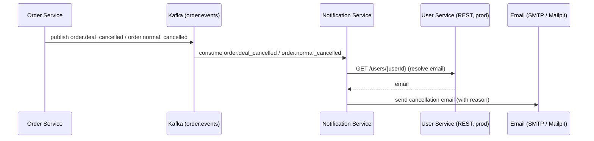
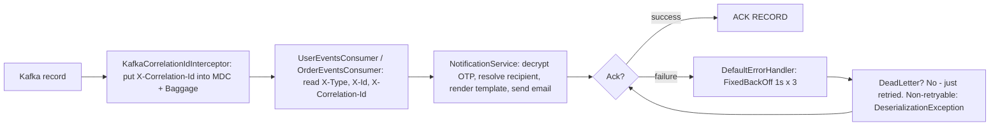
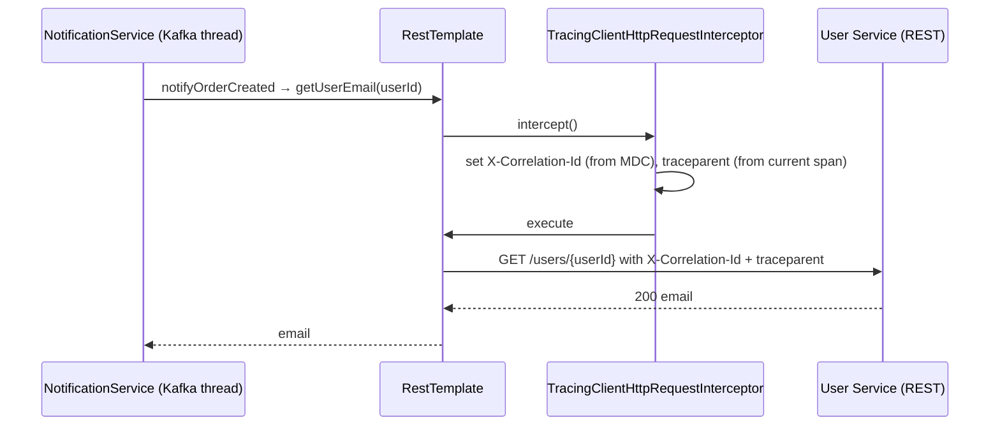

# Notification Service — Kafka Contracts & Workflow

This document describes the notification-service contract for Rally in the same style as `payment_service.md` and `auth_service.md`.

It focuses on the consumption-driven email flow:

- Notification Service consumes domain events published on Kafka by User Service and Order Service.
- Notification Service does **not** persist state: there is **no database, no inbox table, no outbox table**.
- Notification Service owns the delivery decision: it turns each event into a transactional email sent over SMTP.
- Recipient resolution is delegated: user events carry the email inline; order events carry only a `userId`, so the service resolves the address via the user service (`GET /users/{id}` in `prod`, a fake client in `dev`).
- OTP payloads arrive AES-GCM encrypted from User Service; Notification Service decrypts them using the shared key material before rendering the template.

The selected integration model is:

- `user.events` — inbound user lifecycle events.
- `order.events` — inbound order lifecycle events.

Notification Service publishes **no** topics and exposes **no** REST API beyond Actuator. It is a pure consumer.

---

## 1. Notification DB Schema

**None.** The service has no persistence layer — no JPA/JDBC dependencies, no Flyway/Liquibase migrations, no SQL DDL. Keep this section only to make the intended contract explicit:

> Notification Service is **stateless with respect to messages**. All state lives in the producing services. The service relies on Kafka at-least-once delivery plus the consumer error handler for retries; **duplicate redelivery is not deduplicated**, so a redelivered event can produce a duplicate email.

---

## 2. Notification Domain Model

### 2.1 Typed event records

Notification Service is driven entirely by typed event records consumed from Kafka. They are the only "domain model":

| Event | Topic | Fields |
|---|---|---|
| `UserRegistered` | `user.events` | `userId`, `email`, `role`, `createdAt` |
| `EmailVerificationRequested` | `user.events` | `userId`, `email`, `otp` (encrypted) |
| `PasswordResetRequested` | `user.events` | `userId`, `email`, `otp` (encrypted) |
| `OrderCreated` | `order.events` | `orderId`, `userId`, `items[]`, `totalPrice`, `address` |
| `OrderAuthorized` | `order.events` | `orderId`, `dealId`, `userId`, `totalPrice` |
| `DealOrderCancelled` | `order.events` | `orderId`, `dealId`, `participantId`, `userId`, `reason`, `items[]`, `totalPrice` |
| `NormalOrderCancelled` | `order.events` | `orderId`, `userId`, `cancelReason`, `items[]`, `totalPrice`, `paymentErrorMessage` |

The deserializer picks the target record class from the `X-Type` header via a `DefaultJacksonJavaTypeMapper` (`.setClassIdFieldName("X-Type")`, `TypePrecedence.TYPE_ID`, trusted packages `com.rally.notification.messaging.event`). The explicit id-class mapping in `KafkaConfig.createTypeMapper` is:

| `X-Type` | Record class |
|---|---|
| `Order.Created` | `OrderCreated` |
| `Order.Authorized` | `OrderAuthorized` |
| `Order.DealCancelled` | `DealOrderCancelled` |
| `Order.NormalCancelled` | `NormalOrderCancelled` |
| `User.Registered` | `UserRegistered` |
| `User.EmailVerificationRequested` | `EmailVerificationRequested` |
| `User.PasswordResetRequested` | `PasswordResetRequested` |

### 2.2 `OrderProductResponse` (item line)

Embedded in order payloads. Fields:

- `productId`
- `productName`
- `productImageUrl`
- `quantity`
- `unitPrice`

### 2.3 `CancelReason` enum

Used by `DealOrderCancelled.reason` and `NormalOrderCancelled.cancelReason`:

`INSUFFICIENT_STOCK`, `INVENTORY_UNREACHABLE`, `RESERVATION_INCOMPLETE`, `PAYMENT_DECLINED`, `PAYMENT_TIMEOUT`, `DEAL_FAILED`, `DEAL_RESOLVED`, `PARTICIPANT_LEFT`, `SERVER_ERROR`.

### 2.4 Scope — user stories

- As a new registrant, I want to receive a welcome email, so I know my Rally account is active.
- As a new registrant, I want to receive a verification OTP by email, so I can confirm my address.
- As a user who forgot my password, I want to receive a reset OTP by email, so I can create a new password.
- As a buyer, I want to receive an order-created confirmation with my items and total, so I can review my purchase.
- As a deal participant, I want to receive a notification when my join is authorized, so I know the deal is confirmed.
- As a buyer, I want to receive a notification when my order is cancelled, with the reason, so I know the outcome.

---

## 3. Kafka Topic Contracts

Notification Service consumes two topics and publishes none.

### 3.1 Message envelope rule

Every inbound message must carry these headers:

| Header | Required | Purpose |
|---|---|---|
| `X-Id` | yes | Unique message identifier (logged; used for dedup reference by other services) |
| `X-Type` | yes | Message type and operation selector (drives deserialization) |
| `X-Correlation-Id` | yes | Links the message to the business flow; propagated into MDC, spans, and outbound HTTP |
| `traceparent` | yes | W3C distributed-tracing context (propagated by Micrometer/OpenTelemetry) |

The payload must not contain any of those fields.

For inbound events, the message type is selected by `X-Type`, **not** by a payload field. `X-Id` is read and logged by the consumers but is **not** persisted — Notification Service has no dedup store.

### 3.2 Inbound topics

| Topic | Purpose | `X-Type` selector |
|---|---|---|
| `user.events` | Welcome email for a new account | `X-Type = User.Registered` |
| `user.events` | Verification OTP email | `X-Type = User.EmailVerificationRequested` |
| `user.events` | Password-reset OTP email | `X-Type = User.PasswordResetRequested` |
| `order.events` | Order-created confirmation | `X-Type = Order.Created` |
| `order.events` | Deal join authorized | `X-Type = Order.Authorized` |
| `order.events` | Deal order cancelled | `X-Type = Order.DealCancelled` |
| `order.events` | Regular order cancelled | `X-Type = Order.NormalCancelled` |

### 3.3 No outbound topics

Notification Service publishes **no** topics — it is a leaf consumer. There is therefore no outbox table and no outbox relay.

> **Tradeoff (accepted):** delivering an email is a side effect performed on the consuming side with at-least-once semantics and **no idempotency guard**. Duplicate/redelivered events may yield duplicate emails. Acceptable for transactional email today; if deduplication is required later, add an inbox table keyed on `X-Id`.

---

## 4. Message Payload Schemas

### 4.1 `user.registered`

Consumed when an account is created.

Headers:

| Header | Example |
|---|---|
| `X-Type` | `User.Registered` |
| `X-Id` | `uuid` |
| `X-Correlation-Id` | `uuid` (echoed from the registering request) |
| `traceparent` | W3C trace context (propagated by Micrometer/OTLP) |

Payload:

```json
{
  "userId": "uuid",
  "email": "alex.j@example.com",
  "role": "BUYER",
  "createdAt": "2026-07-30T10:15:00Z"
}
```

Recipient = `email` (inline). Sends "Welcome to Rally!" using `email/user-registered`.

### 4.2 `user.email_verification_requested`

Consumed when a verification OTP is generated (registration or resend).

Headers:

| Header | Example |
|---|---|
| `X-Type` | `User.EmailVerificationRequested` |
| `X-Id` | `uuid` |
| `X-Correlation-Id` | `uuid` |
| `traceparent` | W3C trace context (propagated by Micrometer/OTLP) |

Payload:

```json
{
  "userId": "uuid",
  "email": "alex.j@example.com",
  "otp": "<AES-GCM-encrypted 6-digit code>"
}
```

`otp` is the AES-GCM encrypted code produced by User Service (`OtpEncryptor`, `AES/GCM/NoPadding` + `PBKDF2WithHmacSHA256`, keyed from `app.otp.encryption.password`/`salt`). Notification Service decrypts it with `OtpDecryptor` (`Encryptors.text`) before rendering — the OTP never appears in the email template in clear form at ingestion (`security/OtpDecryptor.java:30`).

### 4.3 `user.password_reset_requested`

Consumed when a password-reset OTP is generated (`POST /auth/forgot-password`).

Headers:

| Header | Example |
|---|---|
| `X-Type` | `User.PasswordResetRequested` |
| `X-Id` | `uuid` |
| `X-Correlation-Id` | `uuid` |
| `traceparent` | W3C trace context (propagated by Micrometer/OTLP) |

Payload:

```json
{
  "userId": "uuid",
  "email": "alex.j@example.com",
  "otp": "<AES-GCM-encrypted 6-digit code>"
}
```

Same decryption rule as §4.2.

### 4.4 `order.created`

Consumed when a normal order is created.

Headers:

| Header | Example |
|---|---|
| `X-Type` | `Order.Created` |
| `X-Id` | `uuid` |
| `X-Correlation-Id` | `uuid` |
| `traceparent` | W3C trace context (propagated by Micrometer/OTLP) |

Payload:

```json
{
  "orderId": "uuid",
  "userId": "uuid",
  "items": [
    {
      "productId": "uuid",
      "productName": "Wireless Mouse",
      "productImageUrl": "/products/mouse.png",
      "quantity": 2,
      "unitPrice": 24.99
    }
  ],
  "totalPrice": 49.98,
  "address": "12 Main St, Cairo"
}
```

Recipient = `userServiceClient.getUserEmail(userId)` (not in the payload — resolved via user service).

### 4.5 `order.authorized`

Consumed when a deal join is authorized.

Headers:

| Header | Example |
|---|---|
| `X-Type` | `Order.Authorized` |
| `X-Id` | `uuid` |
| `X-Correlation-Id` | `uuid` |
| `traceparent` | W3C trace context (propagated by Micrometer/OTLP) |

Payload:

```json
{
  "orderId": "uuid",
  "dealId": "uuid",
  "userId": "uuid",
  "totalPrice": 199.00
}
```

Recipient = `userServiceClient.getUserEmail(userId)`.

### 4.6 `order.deal_cancelled`

Consumed when a deal order is cancelled.

Headers:

| Header | Example |
|---|---|
| `X-Type` | `Order.DealCancelled` |
| `X-Id` | `uuid` |
| `X-Correlation-Id` | `uuid` |
| `traceparent` | W3C trace context (propagated by Micrometer/OTLP) |

Payload:

```json
{
  "orderId": "uuid",
  "dealId": "uuid",
  "participantId": "uuid",
  "userId": "uuid",
  "reason": "PAYMENT_DECLINED",
  "items": [
    {
      "productId": "uuid",
      "productName": "Wireless Mouse",
      "productImageUrl": "/products/mouse.png",
      "quantity": 2,
      "unitPrice": 24.99
    }
  ],
  "totalPrice": 49.98
}
```

`reason` is a `CancelReason` enum value (§2.3). Recipient = `userServiceClient.getUserEmail(userId)`.

### 4.7 `order.normal_cancelled`

Consumed when a regular order is cancelled.

Headers:

| Header | Example |
|---|---|
| `X-Type` | `Order.NormalCancelled` |
| `X-Id` | `uuid` |
| `X-Correlation-Id` | `uuid` |
| `traceparent` | W3C trace context (propagated by Micrometer/OTLP) |

Payload:

```json
{
  "orderId": "uuid",
  "userId": "uuid",
  "cancelReason": "PAYMENT_DECLINED",
  "items": [
    {
      "productId": "uuid",
      "productName": "Wireless Mouse",
      "productImageUrl": "/products/mouse.png",
      "quantity": 2,
      "unitPrice": 24.99
    }
  ],
  "totalPrice": 49.98,
  "paymentErrorMessage": "The card was declined"
}
```

`cancelReason` is a `CancelReason` enum value (§2.3). Recipient = `userServiceClient.getUserEmail(userId)`.

### 4.8 Required Headers

| Header | Purpose |
|---|---|
| `X-Id` | Unique message id for message dedupe (persisted by producers; logged here) |
| `X-Type` | Event or command type (drives JSON deserialization) |
| `X-Correlation-Id` | Correlates the event with the business flow |
| `traceparent` | W3C distributed-tracing identifier |

### 4.9 Payload rule

The payload for every message must contain only business data.

The payload must not contain:

- message id
- correlation id
- trace id
- type

Those belong only in headers.

### 4.10 OTP handling rule

An OTP never crosses the topic in the clear. Producers encrypt it (AES-GCM, keyed from `app.otp.encryption.password`/`salt`); Notification Service decrypts it in `OtpDecryptor` right before rendering the verification/reset template. The shared key material **must match** on User Service (`rally-auth`) and Notification Service (§7.2). If the shared key changes, previously produced OTPs can no longer be decrypted and their emails will fail as `IllegalStateException`.

---

## 5. Email Delivery

### 5.1 Email sender

- `mail/EmailSender.java` — SPI: `void send(String to, String subject, String htmlBody)`.
- `mail/impl/EmailSenderImpl.java` — JavaMail (`JavaMailSender`) implementation. Builds a `MimeMessage` via `MimeMessageHelper` (UTF-8, HTML `true`), sets from/to/subject/body, then submits to SMTP. `fromAddress` = `notification.mail.from`.
- Default SMTP target in development is **Mailpit** (`localhost:1080` SMTP, `localhost:8035` web UI) via `docker-compose.yml`.

### 5.2 Template rendering

Templates live in `src/main/resources/templates/email/` and are rendered with Thymeleaf `SpringTemplateEngine`. Each consumed event maps to exactly one template:

| Event `X-Type` | Template | Context variables | Email subject | Recipient |
|---|---|---|---|---|
| `User.Registered` | `email/user-registered` | `email`, `role` | Welcome to Rally! | `event.email()` |
| `User.EmailVerificationRequested` | `email/email-verification` | `otp` (decrypted) | Verify your email | `event.email()` |
| `User.PasswordResetRequested` | `email/password-reset` | `otp` (decrypted) | Reset your password | `event.email()` |
| `Order.Created` | `email/order-created` | `orderId`, `items`, `totalPrice`, `address` | Your order has been created | user service (`userId`) |
| `Order.Authorized` | `email/order-authorized` | `orderId`, `dealId`, `totalPrice` | Your join has been authorized | user service (`userId`) |
| `Order.DealCancelled` | `email/order-deal-cancelled` | `orderId`, `dealId`, `reason`, `items`, `totalPrice` | Your deal order has been cancelled | user service (`userId`) |
| `Order.NormalCancelled` | `email/order-normal-cancelled` | `orderId`, `cancelReason`, `items`, `totalPrice`, `paymentErrorMessage` | Your order has been cancelled | user service (`userId`) |

User events carry the recipient inline; order events carry only `userId` and require a user-service lookup (§6).

### 5.3 OTP decryption

`security/OtpDecryptor.java` uses Spring Security `Encryptors.text(password, salt)` — matching User Service's `OtpEncryptor` (same `AES/GCM/NoPadding` + `PBKDF2WithHmacSHA256` derivation). It throws `IllegalStateException` if the key material is missing or decryption fails.

---

## 6. Flows

### 6.1 Registration & Email Verification

```mermaid
sequenceDiagram
    participant C as Client
    participant U as User Service
    participant X as Outbox
    participant K as Kafka (user.events)
    participant N as Notification Service
    participant E as Email (SMTP / Mailpit)

    C->>U: POST /auth/register
    U->>X: write user.registered + user.email_verification_requested (same tx; OTP AES-GCM encrypted)
    X->>K: relay both events
    K->>N: consume user.email_verification_requested (decrypt otp)
    N->>E: send verification email (EmailVerificationRequested.event email)
    K->>N: consume user.registered
    N->>E: send welcome email (UserRegistered.event email)
```

### 6.2 Password Reset



### 6.3 Order Created



### 6.4 Order Authorized



### 6.5 Order Cancelled



### 6.6 Consumption & retry behavior



Rules:

- `AckMode.RECORD` with `auto-offset-reset=earliest`; offsets are committed record-by-record only on success.
- `DefaultErrorHandler` + `FixedBackOff(1000, 3)` retries transient failures 3 times with 1-second backoff, then fails the record.
- `DeserializationException` is registered as **non-retryable** — malformed payloads fail fast without stalling the partition (they are not sent to a DLT).
- There is **no inbox deduplication**: redelivery can reprocess. There is **no outbox**: Notification Service never publishes.

---

## 7. API Surface

The service is **not** a producer of APIs. It exposes only Spring Actuator endpoints for health and introspection; there are no `@RestController` classes.

### 7.1 Reliability and Ops (Actuator)

| Method | Path | Purpose |
|---|---|---|
| `GET` | `/actuator/health` | Application and dependency health |
| `GET` | `/actuator/info` | Build and deployment metadata |

> Only `health` and `info` are currently exposed via `management.endpoints.web.exposure.include` in `application.properties`. `metrics` and `prometheus` are **not** exposed — the README's claim to the contrary is out of date.

### 7.2 Configuration

All configuration lives in `src/main/resources/application.properties` (there are no per-profile config files). Externalizable values are overridable via environment variables, loaded from an optional `.env` file.

```properties
# App identity
spring.application.name=rally-notification
server.port=${SERVER_PORT:8010}
spring.profiles.active=${SPRING_PROFILES_ACTIVE:dev}

# Kafka
spring.kafka.bootstrap-servers=${KAFKA_BOOTSTRAP_SERVERS:localhost:9092}
spring.kafka.producer.acks=all
spring.kafka.producer.retries=3
spring.kafka.producer.properties.enable.idempotence=true
spring.kafka.consumer.group-id=notification-service-group
spring.kafka.consumer.auto-offset-reset=earliest
spring.kafka.listener.observation-enabled=true
spring.kafka.template.observation-enabled=true

# Mail
spring.mail.host=${SPRING_MAIL_HOST:localhost}
spring.mail.port=${SPRING_MAIL_PORT:1080}
notification.mail.from=${MAIL_FROM:no-reply@rally.local}

# OTP decryption (must match rally-auth's app.otp.encryption.*)
app.otp.encryption.password=${OTP_ENCRYPTION_PASSWORD:<secret>}
app.otp.encryption.salt=${OTP_ENCRYPTION_SALT:<secret>}

# Tracing / OTLP
management.tracing.enabled=true
management.tracing.sampling.probability=1.0
management.opentelemetry.tracing.export.otlp.endpoint=${OTEL_EXPORTER_OTLP_ENDPOINT:http://localhost:4318/v1/traces}

# Correlation ID baggage (W3C baggage + MDC)
management.tracing.baggage.remote-fields=X-Correlation-Id
management.tracing.baggage.correlation.fields=X-Correlation-Id
management.tracing.baggage.tag-fields=X-Correlation-Id
```

| Property | Default | Effect |
|---|---|---|
| `server.port` | `8010` | HTTP port (Actuator only) |
| `spring.profiles.active` | `dev` | profile selection; `dev` uses the fake user client, `prod` the REST client (§7.3) |
| `spring.kafka.bootstrap-servers` | `localhost:9092` | Kafka broker address |
| `spring.kafka.consumer.group-id` | `notification-service-group` | consumer group id |
| `spring.mail.host` / `spring.mail.port` | `localhost` / `1080` | Mailpit (SMTP). Web UI at `localhost:8035` |
| `notification.mail.from` | `no-reply@rally.local` | envelope sender |
| `app.otp.encryption.password` / `.salt` | dev defaults | AES-GCM / PBKDF2 key material; **must match** User Service (`rally-auth`) |
| `user.service.url` | — (required in `prod`) | base URL for the user service (e.g. `http://user-service:8011`); used only by the `prod` client |
| `management.opentelemetry.tracing.export.otlp.endpoint` | `http://localhost:4318/v1/traces` | OTLP/HTTP trace export endpoint |

### 7.3 Profiles

| Profile | UserServiceClient | Logback console |
|---|---|---|
| `dev` (default) | `UserServiceFakeClientImpl` — synthetic `user-<uuid>@example.com`, no network | plain text |
| `prod` | `UserServiceClientImpl` — `GET {user.service.url}/users/{userId}`, `RestTemplate` + tracing interceptor | JSON (Logstash) |
| `local` | — (logback grouping, not used by any code annotation) | plain text |

In `prod`, `UserServiceClientImpl.getUserEmail` issues `GET {userServiceUrl}/users/{userId}` and returns the response body as the email. Errors map to shared exceptions: `ResourceAccessException` → `ServiceUnavailableException`, `HttpServerErrorException` → `InternalServerErrorException` (from `rally-common`).

### 7.4 Outbound HTTP tracing propagation

Outbound calls from the `prod` client go through the shared `RestTemplate` bean (`RestClientConfig`), which registers `TracingClientHttpRequestInterceptor`:

- `TracingClientHttpRequestInterceptor` copies `X-Correlation-Id` from MDC into the outbound request headers, and writes a W3C `traceparent` (`00-<traceId>-<spanId>-01`) from the current Micrometer span — so a REST call to the user service joins the same distributed trace, with timeout defaults of 2s connect / 5s read.



---

## 8. Correlation & Tracing

### 8.1 Kafka intake

`KafkaCorrelationIdInterceptor` (a `RecordInterceptor`) runs before every consumed record:

- reads `X-Correlation-Id` from the record headers,
- puts it into MDC and a Micrometer `BaggageInScope`,
- removes both in `afterRecord`.

### 8.2 HTTP intake (Actuator)

`CorrelationIdFilter` reads `X-Correlation-Id` from the request header (generating a UUID if absent), puts it in MDC + Baggage, and echoes it on the response (relevant only for Actuator endpoints, since the service exposes no API).

### 8.3 Outbound HTTP

`TracingClientHttpRequestInterceptor` propagates the correlation ID and W3C `traceparent` from the current span on every `prod` user-service call (§7.4).

### 8.4 Logging / OTLP

- Logs include `traceId`, `spanId`, and `X-Correlation-Id` (plain text in dev, Logstash JSON in prod) via `logback-spring.xml`, with a Loki appender (`loki.url`, default `http://localhost:3100/loki/api/v1/push`).
- Traces export over OTLP HTTP with 100% sampling; Kafka consumers/producers are observed (`observation-enabled`), which auto-propagates `traceparent` from producers to this consumer.

---

## 9. Notification Service Responsibilities

The notification service owns:

- consuming `user.events` and `order.events`,
- mapping each event to the correct email template,
- decrypting encrypted OTP payloads (shared key material with `rally-auth`),
- resolving recipient emails for order events via the user service,
- rendering HTML templates with Thymeleaf,
- delivering email over SMTP,
- propagating correlation/tracing context across the consume-render-send path.

The notification service does not own:

- user identity, OTP generation, or verification (User Service),
- order state transitions (Order Service),
- payment state transitions (Payment Service),
- any persistence — there is no inbox/outbox, no DB, and no deduplication store.

---

## 10. Notes on Naming

For Rally, keep the contract names aligned with User Service and Order Service.

### Topic Names

- `user.events` (inbound only)
- `order.events` (inbound only)

### Inbound Message `X-Type` Values

- `User.Registered`
- `User.EmailVerificationRequested`
- `User.PasswordResetRequested`
- `Order.Created`
- `Order.Authorized`
- `Order.DealCancelled`
- `Order.NormalCancelled`

### Outbound Message `X-Type` Values

None — Notification Service is consume-only.

Keep topic names lowercase and domain-oriented. Keep `X-Type` values as the message contract identifiers, and keep enum casing only in code-level models where needed.

---

## 11. Summary

The notification service is a consume-only, stateless, SMTP-delivering email service.

Its job is to:

1. consume `user.events` and `order.events`,
2. decrypt encrypted OTP payloads with the shared `rally-auth` key material,
3. resolve recipient addresses (inline email for user events; user-service lookup for order events),
4. render a Thymeleaf template per event type,
5. deliver transactional email over SMTP,
6. and thread `X-Correlation-Id` + W3C `traceparent` through the whole path for observability.