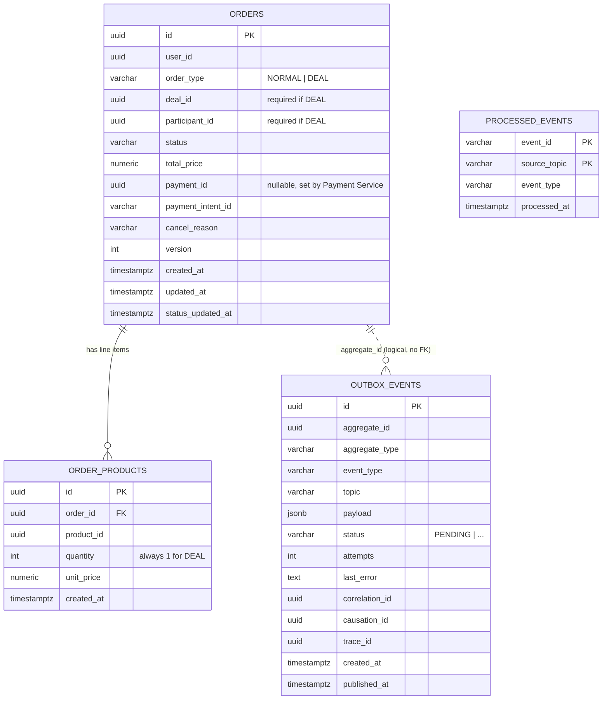
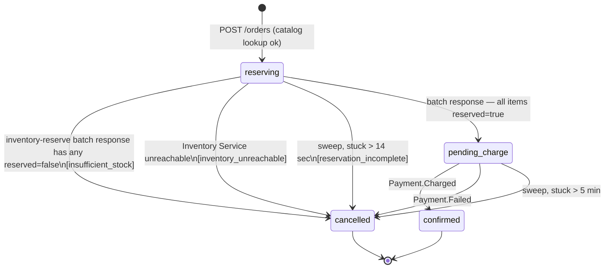
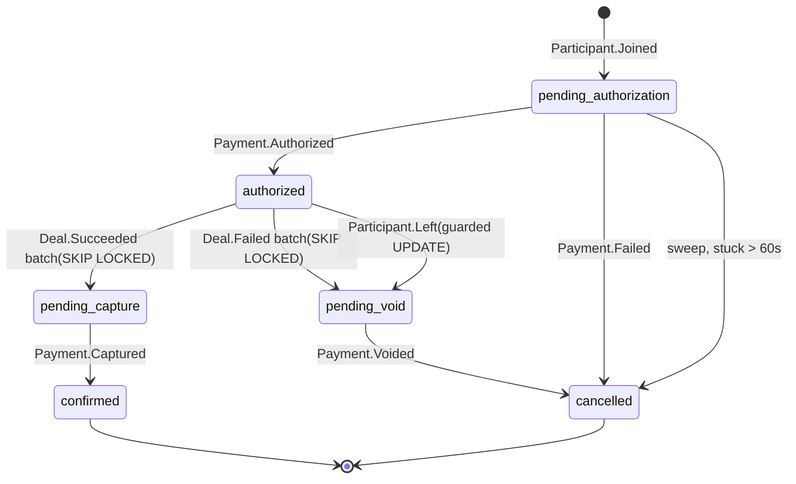

# Order Service — Data Model, Events & Purchase Flows

## 1. Order Data Model (ERD)



**Constraints & indexes not shown above:**
- `orders.status` is one of `RESERVING, PENDING_CHARGE, PENDING_AUTHORIZATION, AUTHORIZED,
  PENDING_CAPTURE, PENDING_VOID, CONFIRMED, CANCELLED`; `cancel_reason` is one of
  `INSUFFICIENT_STOCK, INVENTORY_UNREACHABLE, RESERVATION_INCOMPLETE, PAYMENT_DECLINED,
  PAYMENT_TIMEOUT, DEAL_FAILED, PARTICIPANT_LEFT`.
- `deal_fields_consistency` check: `deal_id`/`participant_id` set together for `DEAL`,
  both null for `NORMAL`.
- Unique index on `(deal_id, participant_id) WHERE order_type = 'DEAL'` — guards against a
  redelivered `Participant.Joined` creating two orders for the same slot.
- Index on `(status, status_updated_at)` — sweep jobs key off `status_updated_at`, not
  `updated_at`, since `updated_at` bumps on any column change (e.g. setting `payment_id`
  without a status transition).
- Two triggers keep `updated_at` and `status_updated_at` accurate automatically, so sweep
  jobs never depend on application code remembering to set them by hand.
- `outbox_events` is the transactional outbox for everything Order Service publishes — the
  publish is part of the same commit as the business write; a relay process polls
  `WHERE status = 'PENDING'` and delivers to Kafka at-least-once.
- `processed_events` is inbound Kafka dedup — every consumer checks/inserts here in the
  same transaction as its business write, so at-least-once redelivery is a no-op.
  Primary key is `(event_id, source_topic)`, not `event_id` alone.

---

## 2. Order Status & State Machine

Two independent flows share `orders`. `reserving`/`pending_charge` exist only for
`order_type = NORMAL`; `pending_authorization`/`authorized`/`pending_capture`/`pending_void`
exist only for `order_type = DEAL`. `confirmed` and `cancelled` are terminal for both.
Every transition into a terminal or intermediate state is a conditional
`UPDATE ... WHERE status = <expected>` — this guard makes a reconciliation-sweep cancel
and a late payment event mutually exclusive: whichever commits first wins, the other is a no-op.

### 2.1 NORMAL flow



### 2.2 DEAL flow



**Sweep behavior differs by stage**: orders stuck in
`pending_authorization` > 60s are **force-cancelled** (silence = failure; `release-slot`
called — `reserved_stock--` only, since the order never reached `authorized`). Orders stuck
in `pending_capture` or `pending_void` > 60s are instead **re-published**: the same
`order.payment_settlement_requested` (type=CAPTURE/VOID, idempotencyKey=payment_id) fires
again, never a cancel, because capture/void against an existing `payment_id` is idempotent
and the deal outcome is already decided at that point.

Both void paths park the order in `pending_void` before firing the VOID (team decision):
the `deal.Failed` batch does it via `FOR UPDATE SKIP LOCKED`, and the participant-leave
path does it via a guarded `UPDATE ... WHERE status = 'authorized'` immediately on consuming
`participant.Left`. This closes the race where a concurrent `deal.Succeeded`/`deal.Failed`
batch over the same `deal_id` could grab an order whose leave-void was still in flight —
the batch selects `WHERE status = 'authorized'` and skips anything already parked.

---

## 3. Order Service — Endpoints

### 3.1 `GET /users/{id}/orders`

Paginated list of a user's orders, filterable by `status` and `orderType`.

**Query params**
| Param | Type | Required | Notes |
|---|---|---|---|
| `status` | string | no | one of `pending_payment`, `confirmed`, `cancelled` |
| `orderType` | string | no | `NORMAL` \| `DEAL` |
| `page` | int | no | default `1` |
| `limit` | int | no | default `20`, max `100` |

**Response — 200**
```json
{
  "orders": [
    {
      "id": "ord_...",
      "userId": "b3f1...",
      "orderType": "NORMAL",
      "status": "confirmed",
      "totalPrice": 129.97,
      "items": [
        { "productId": "8a2c...", "quantity": 2, "unitPrice": 39.99 },
        { "productId": "c091...", "quantity": 1, "unitPrice": 49.99 }
      ],
      "createdAt": "2026-07-12T10:15:00Z"
    }
  ],
  "page": 1,
  "limit": 20,
  "total": 1
}
```

**Errors**
| Status | Cause |
|---|---|
| 400 | invalid `status`/`orderType` filter value, bad `page`/`limit` |
| 401/403 | requester is not `{id}` and does not hold an admin role (see order-service-spec.md §9.8 — authz on read endpoints was never fully resolved in the source doc) |

---

### 3.2 `GET /orders/{id}`

Returns a single order and its line items.

**Response — 200**
```json
{
  "id": "ord_...",
  "userId": "b3f1...",
  "orderType": "NORMAL",
  "status": "confirmed",
  "totalPrice": 129.97,
  "items": [
    { "productId": "8a2c...", "quantity": 2, "unitPrice": 39.99 },
    { "productId": "c091...", "quantity": 1, "unitPrice": 49.99 }
  ],
  "createdAt": "2026-07-12T10:15:00Z"
}
```

**Errors**
| Status | Cause |
|---|---|
| 404 | no order with this `id` |
| 401/403 | requester is neither the order's `userId` nor an admin/seller role owning the underlying product |

---

### 3.3 `POST /orders` — Normal checkout

**Request**
```json
{
  "userId": "b3f1...",
  "paymentIntentId": "pi_...",
  "items": [
    { "productId": "8a2c...", "quantity": 2 },
    { "productId": "c091...", "quantity": 1 }
  ]
}
```

**Response — 201**
```json
{
  "id": "ord_...",
  "userId": "b3f1...",
  "orderType": "NORMAL",
  "status": "confirmed",
  "totalPrice": 129.97,
  "paymentIntentId": "pi_...",
  "items": [
    { "productId": "8a2c...", "quantity": 2, "unitPrice": 39.99 },
    { "productId": "c091...", "quantity": 1, "unitPrice": 49.99 }
  ],
  "createdAt": "2026-07-12T10:15:00Z"
}
```

**Errors**
| Status | Cause | Body |
|---|---|---|
| 400 | empty cart, bad quantity, unknown field | `{ "error": "..." }` |
| 404 | `productId` doesn't exist | `{ "error": "..." }` |
| 402 | Payment Service declined authorize/capture | `{ "error": "card_declined", "paymentIntentId": "pi_..." }` — `paymentIntentId` is still returned since Stripe creates the intent before declining it |
| 503 | Payment Service or Catalog Service unreachable | `{ "error": "..." }` — no order persisted as `confirmed`; see order-service-spec.md §9.2 for the fail-fast-vs-reconcile decision |

---

## 4. Service Contracts

### 4.1 Catalog Service

| Request Endpoint | Request Body | Response Body |
|---|---|---|
| `POST /products/lookup` | `{ "productIds": ["8a2c...", "c091..."] }` | `{ "found": [{ "id": "8a2c...", "basePrice": 39.99 }], "notFound": ["c091..."] }` |

### 4.2 Inventory Service

Published events are on `order.lifecycle` topic.

Reservation is a single batch call — one request per order, covering every line item,
not one request per product. The batch is **atomic in effect**: if any item can't be
reserved, Inventory Service releases whatever it had already reserved for the other items
in that same call before responding, so a failed batch never leaves a partial reservation
behind. The per-item `reserved: true/false` flags are diagnostic only — they tell Order
Service which product(s) caused the failure; they don't indicate items Order Service needs
to release itself.

| Request Endpoint | Request Body | Response Body |
|---|---|---|
| `POST /inventory/order-reserve` | `{ "orderId": "c4d2...", "items": [{"productId": "8a2c...", "quantity": 2}, ...] }` | `{ "orderId": "c4d2...", "items": [{"productId": "8a2c...", "available": 10, "reserved": true}, ...] }` |

| Published Event | Payload |
|---|---|
| `Order.NormalCancelled` | `(order_id, user_id, cancelReason, [{product_id, quantity}])` |

### 4.3 Deal Service

| Request Endpoint | Request Body | Expected Action |
|---|---|---|
| `POST /deals/{deal_id}/authorize-slot` | None | increment `authorized_count` |
| `POST /deals/{deal_id}/release-slot` | None | decrement `reserved_stock` |
| `POST /deals/{deal_id}/release-authorized-slot` | None | increment `reserved_stock` & `authorized_count` |

| Received Event | Payload | Reaction |
|---|---|---|
| `Deal.Succeeded` | `(deal_id, deal_stock, authorized_count)` | 1. Batch: `SELECT ... WHERE deal_id = ? AND status = authorized FOR UPDATE SKIP LOCKED` → `status = pending_capture`<br>2. Fire `Order.payment_settlement_requested(payment_id, 'CAPTURE')` per order |
| `Deal.Failed` | `(deal_id, deal_stock, authorized_count)` | 1. Batch: same pattern → `status = pending_void`<br>2. Fire `Order.payment_settlement_requested(order_id, payment_id, 'VOID')` per order |

### 4.4 Payment Service

- Order Service publishes payment-related events on `order.payments_requested`.
- Order Service receives payment-related events on `Payment.events`.

| Published Event | Payload | Reaction |
|---|---|---|
| `Payment.InitRequired.Charge` | `{user_id, order_id, amount, payment_intent_id}` | Charge the amount using `paymentIntentId` |
| `Payment.InitRequired.Authorize` | `{user_id, order_id, amount, payment_intent_id}` | Authorize the amount using `paymentIntentId` |
| `Payment.SettlementRequired.Capture` | `{order_id, payment_id}` | Capture the held amount |
| `Payment.SettlementRequired.Void` | `{order_id, payment_id}` | Release the held amount |
| `Payment.Timeout` | `{order_id}` | Cancel a stuck order |

| Received Event | Payload | Reaction |
|---|---|---|
| `Payment.Failed` | `(payment_id, payment_intent_id, order_id, amount, errorMessage, errorCode)` | 1. Get order by `order_id`<br>2. `UPDATE status = cancelled WHERE status IN (pending_charge, pending_authorization)` (guard)<br>3. Set `payment_id` + `payment_intent_id`<br>4. DEAL path only: call `release-slot` (sync — `reserved_stock--`; order never reached `authorized`, so `authorized_count` is untouched)<br>5. Fire `Order.NormalCancelled` (NORMAL) or `Order.DealCancelled` (DEAL) |
| `Payment.Charged` | `(payment_id, payment_intent_id, order_id, amount)` | 1. Get order by `order_id`<br>2. `UPDATE status = confirmed WHERE status = pending_charge` (guard)<br>3. Set `payment_id` + `payment_intent_id`<br>4. Fire `Order.Created` |
| `Payment.Authorized` | `(payment_id, payment_intent_id, order_id, amount)` | 1. Get order by `order_id`<br>2. `UPDATE status = authorized WHERE status = pending_authorization` (guard)<br>3. Set `payment_id` + `payment_intent_id`<br>4. Call `authorize-slot` (sync — `authorized_count++`; deal may flip `succeeded` here)<br>5. Fire `Order.Authorized` |
| `Payment.Captured` | `(payment_id, payment_intent_id, order_id, amount)` | 1. Get order by `order_id`<br>2. `UPDATE status = confirmed WHERE status = pending_capture` (guard)<br>3. Set `payment_id` + `payment_intent_id`<br>4. Fire `Order.Created` |
| `Payment.Voided` | `(order_id, payment_id, payment_intent_id, amount)` | 1. Get order by `order_id`<br>2. `UPDATE status = cancelled WHERE status = pending_void` (guard), `cancel_reason` = `deal_failed` or `participant_left` depending on which path parked the order<br>3. Leave path only: call `release-authorized-slot` (sync — `reserved_stock--` and `authorized_count--` atomically; order had reached `authorized` before parking)<br>4. Fire `Order.DealCancelled` |

### 4.5 Participation Service

Published events are on `order.lifecycle` topic.

| Published Event | Payload |
|---|---|
| `Order.DealCancelled` | `(order_id, deal_id, participant_id, user_id, reason)` |

| Received Event | Payload | Reaction |
|---|---|---|
| `Participant.Joined` | `(participant_id, deal_id, user_id, product_id, price, payment_intent_id)` | 1. Create order row, `status = pending_authorization`, `payment_intent_id` from event (+ `order_products` row)<br>2. Fire `Payment.InitRequired.Authorize(user_id, order_id, amount, payment_intent_id)` |
| `Participant.Left` | `(participant_id, deal_id)` | 1. Find existing order `WHERE deal_id = ? AND participant_id = ? AND status = authorized` — no new row created<br>2. `UPDATE status = pending_void WHERE status = authorized` (guard — parks the order so deal-resolution batches skip it)<br>3. Fire `Payment.SettlementRequired.Void(order_id, payment_id)` |

### 4.6 Notification Service

Published events are on `order.lifecycle` topic.

| Published Event | Payload |
|---|---|
| `Order.Created` | `{order_id, user_id, items}` |
| `Order.Authorized` | `{deal_id, user_id}` |
| `Order.NormalCancelled` | `(order_id, user_id, cancelReason, [{product_id, quantity}])` |
| `Order.DealCancelled` | `(order_id, deal_id, participant_id, user_id, reason)` |

---

## 5. Normal Order Flow

1. **Receive & validate.** `POST /orders` payload: non-empty `items`, all `quantity > 0`.
   Merge duplicate `productId` entries by summing quantities. Malformed request → `400`,
   nothing else touched.

2. **Catalog lookup.** `POST /products/lookup` with all merged `productIds` in one call.
    - Any `notFound` → `400`. No order row, no reservation, no charge event.
    - `found` entries give the authoritative `unitPrice` per line item (never trust a
      client-supplied price).
    - Catalog Service unreachable → `503`, order row never created.

3. **Create order.** One DB transaction: insert `orders`
   (`status='reserving'`, `order_type='NORMAL'`, `total_price = Σ(unitPrice × qty)`)
    + one `order_products` row per merged item (prices from step 2).

4. **Inventory reservation.** Single batch call: `POST /inventory/order-reserve` with the
   `orderId` from step 3 and every merged line item (`{productId, quantity}`) in one
   request — not one call per product.
    - Inventory Service unreachable (no response at all):
      `UPDATE orders SET status='cancelled', cancel_reason='inventory_unreachable' WHERE id=?`,
      write `Order.NormalCancelled` to the outbox (all originally-requested items), commit,
      return `503` immediately.
    - Response received but any item has `reserved: false`: Inventory Service has already
      released any items it reserved for this call before responding,
      so no reservation is left outstanding on Inventory Service's side.
      `UPDATE orders SET status='cancelled', cancel_reason='insufficient_stock' WHERE id=?`,
      write `Order.NormalCancelled` to the outbox listing all originally-requested items,
      commit, return `409` immediately.
    - All items come back `reserved: true` → proceed to step 5.

5. **Charge.** `UPDATE orders SET status='pending_charge' WHERE id=? AND status='reserving'`,
   write `Payment.InitRequired.Charge` to the outbox (`{user_id, order_id, amount,
   payment_intent_id, idempotencyKey = order_id}`), commit. Order Service never calls
   Payment Service directly — Payment Service consumes this event, charges the card, and
   publishes `Payment.Charged` or `Payment.Failed` asynchronously.
    - If Order Service's own consumer resolves the order within a short in-request wait
      → return `201` (confirmed) or `402` (declined) synchronously.
    - Otherwise → leave the order as `pending_charge`. Do not cancel/release yet — the
      charge may still succeed on Payment Service's side; releasing now risks confirming a
      payment against stock already sold to someone else. Return `202` immediately.

Resolution is either an inbound event or a sweep-fired outbound event.

**Event consumption:**
- **Case 1 — `Payment.Charged`:** `UPDATE orders SET status='confirmed', payment_id=?
  WHERE id=? AND status='pending_charge'`; if the update affected a row, fire `Order.Created`.
- **Case 2 — `Payment.Failed`:** `UPDATE orders SET status='cancelled',
  cancel_reason='payment_declined' WHERE id=? AND status='pending_charge'`; if the update
  affected a row, fire `Order.NormalCancelled` (`{order_id, user_id, cancelReason,
  [{product_id, quantity}]}`). Inventory Service reacts the same way it reacts to every
  other `Order.NormalCancelled` (§4.2) — Order Service doesn't call `order-release` itself.

**Reconciliation sweep**, every ~30s:
- Orders in `pending_charge` past 5 min → fire `Payment.Timeout`.
- Orders in `reserving` past 2 sec → fire `Order.NormalCancelled` with the full item list.

---

## 6. Deal Order Flow

1. **Join.** Consuming `Participant.Joined`: insert `orders` (`status='pending_authorization'`,
   `order_type='DEAL'`, `deal_id`, `participant_id` from the event) + one `order_products`
   row (`quantity=1`, `unit_price` = event's `price`). `payment_intent_id` comes from the
   event, not generated locally. Write `Payment.InitRequired.Authorize`
   (`{user_id, order_id, amount, payment_intent_id, idempotencyKey = order_id}`) to the
   outbox and commit. No synchronous call to Payment Service — it consumes this event,
   authorizes the hold, and publishes `Payment.Authorized` or `Payment.Failed` asynchronously.

2. **Authorization resolves.**
    - **`Payment.Authorized` consumed:** `UPDATE orders SET status='authorized', payment_id=?
     WHERE id=? AND status='pending_authorization'` (guard). Call `authorize-slot` on Deal
      Service synchronously (`authorized_count++`; this call may flip the deal to `succeeded`
      on Deal Service's side). Fire `Order.Authorized`.
    - **`Payment.Failed` consumed:** `UPDATE orders SET status='cancelled',
     cancel_reason='payment_declined' WHERE id=? AND status='pending_authorization'` (guard).
      Call `release-slot` (`reserved_stock--`; the order never reached `authorized`, so
      `authorized_count` is untouched). Fire `Order.DealCancelled`.

3. **Deal resolves.** Deal Service batches over every order still `authorized` for a
   `deal_id`, using `FOR UPDATE SKIP LOCKED` so concurrent batches don't collide:
    - **`Deal.Succeeded` consumed:** batch `status='authorized' → 'pending_capture'`;
      fire `Payment.SettlementRequired.Capture` (`{order_id, payment_id}`) per order.
    - **`Deal.Failed` consumed:** batch `status='authorized' → 'pending_void'`;
      fire `Payment.SettlementRequired.Void` (`{order_id, payment_id}`) per order.

4. **Participant leaves (concurrent path).** Consuming `Participant.Left`: find the
   existing order `WHERE deal_id=? AND participant_id=? AND status='authorized'` — no new
   row is created. `UPDATE status='pending_void' WHERE status='authorized'` (guard) parks
   the order so a concurrent `Deal.Succeeded`/`Deal.Failed` batch skips it. Fire
   `Payment.SettlementRequired.Void` (`{order_id, payment_id}`).

5. **Settlement resolves.**
    - **`Payment.Captured` consumed:** `UPDATE orders SET status='confirmed', payment_id=?
     WHERE id=? AND status='pending_capture'` (guard). Fire `Order.Created`.
    - **`Payment.Voided` consumed:** `UPDATE orders SET status='cancelled',
     cancel_reason=<'deal_failed'|'participant_left'> WHERE id=? AND status='pending_void'`
      (guard; reason depends on which path parked the order). Leave path only: call
      `release-authorized-slot` (`reserved_stock--` and `authorized_count--` atomically —
      the order had reached `authorized` before parking, unlike the plain `release-slot`
      case in step 2). Fire `Order.DealCancelled`.

**Reconciliation sweep**, every ~30s, thresholds are 60s (vs. 5 min/2 sec for NORMAL —
deals settle on a much tighter clock):
- Orders in `pending_authorization` past 60s → **force-cancel**: `UPDATE status='cancelled',
  cancel_reason='payment_timeout' WHERE status='pending_authorization'` (guard), call
  `release-slot`, fire `Order.DealCancelled`. Silence is treated as failure.
- Orders in `pending_capture` or `pending_void` past 60s → **re-publish**, never cancel:
  re-fire the same `Payment.SettlementRequired.Capture`/`Void` with
  `idempotencyKey=payment_id`. Capture/void against an existing `payment_id` is idempotent,
  and the deal outcome is already decided once an order reaches these states.

---

## Appendix: SQL Schema

```sql
-- =====================================================================

CREATE EXTENSION IF NOT EXISTS pgcrypto;

-- =====================================================================
-- orders
-- =====================================================================

CREATE TABLE orders (
    id                UUID PRIMARY KEY DEFAULT gen_random_uuid(),
    user_id           UUID NOT NULL,
    order_type        VARCHAR(10) NOT NULL CHECK (order_type IN ('NORMAL', 'DEAL')),

    deal_id           UUID NULL,               -- required if order_type = 'DEAL'
    participant_id    UUID NULL,               -- required if order_type = 'DEAL'

    status            VARCHAR(50) NOT NULL CHECK (status IN (
                          'RESERVING',
                          'PENDING_CHARGE',
                          'PENDING_AUTHORIZATION',
                          'AUTHORIZED',
                          'PENDING_CAPTURE',
                          'PENDING_VOID',
                          'CONFIRMED',
                          'CANCELLED'
                      )),

    total_price       NUMERIC(10,2) NOT NULL CHECK (total_price >= 0),
    payment_id        UUID NULL,               -- set once Payment Service returns a payment_id
    payment_intent_id VARCHAR(255) NULL,
    cancel_reason     VARCHAR(30) NULL CHECK (cancel_reason IN (
                          'INSUFFICIENT_STOCK', 'INVENTORY_UNREACHABLE', 'RESERVATION_INCOMPLETE',
                          'PAYMENT_DECLINED', 'PAYMENT_TIMEOUT', 'DEAL_FAILED', 'PARTICIPANT_LEFT'
                      )),

    version           INT NOT NULL DEFAULT 0,  -- optimistic locking / race auditing
    created_at        TIMESTAMPTZ NOT NULL DEFAULT now(),
    updated_at        TIMESTAMPTZ NOT NULL DEFAULT now(),
    status_updated_at TIMESTAMPTZ NOT NULL DEFAULT now(),   -- V5; last time `status` changed

    CONSTRAINT deal_fields_consistency CHECK (
        (order_type = 'DEAL'   AND deal_id IS NOT NULL AND participant_id IS NOT NULL) OR
        (order_type = 'NORMAL' AND deal_id IS NULL AND participant_id IS NULL)
    )
);

-- Guards against a redelivered participant.Joined creating two orders for the same slot.
CREATE UNIQUE INDEX uq_orders_deal_participant
    ON orders (deal_id, participant_id)
    WHERE order_type = 'DEAL';

CREATE INDEX idx_orders_user_id ON orders (user_id);
CREATE INDEX idx_orders_deal_id ON orders (deal_id);
CREATE INDEX idx_orders_status  ON orders (status);

-- Replaces idx_orders_status_updated_at (status, updated_at) from V1, dropped in V5.
-- Sweep jobs key off status_updated_at, not updated_at — updated_at bumps on
-- any column change, e.g. setting payment_id without a status transition.
CREATE INDEX idx_orders_status_status_updated_at ON orders (status, status_updated_at);

-- Keeps updated_at accurate automatically so sweep jobs don't depend on
-- application code remembering to set it on every status change.
CREATE OR REPLACE FUNCTION set_updated_at()
RETURNS TRIGGER AS $$
BEGIN
    NEW.updated_at = now();
    RETURN NEW;
END;
$$ LANGUAGE plpgsql;

CREATE TRIGGER trg_orders_updated_at
    BEFORE UPDATE ON orders
    FOR EACH ROW
    EXECUTE FUNCTION set_updated_at();


CREATE OR REPLACE FUNCTION set_status_updated_at()
RETURNS TRIGGER AS $$
BEGIN
    IF NEW.status IS DISTINCT FROM OLD.status THEN
        NEW.status_updated_at = now();
    END IF;
    RETURN NEW;
END;
$$ LANGUAGE plpgsql;

CREATE TRIGGER trg_orders_status_updated_at
    BEFORE UPDATE ON orders
    FOR EACH ROW
    EXECUTE FUNCTION set_status_updated_at();

-- =====================================================================
-- order_products
-- =====================================================================

CREATE TABLE order_products (
    id          UUID PRIMARY KEY DEFAULT gen_random_uuid(),
    order_id    UUID NOT NULL REFERENCES orders(id),
    product_id  UUID NOT NULL,
    quantity    INT NOT NULL CHECK (quantity > 0),   -- always 1 for DEAL, can be >1 for NORMAL
    unit_price  NUMERIC(10,2) NOT NULL CHECK (unit_price >= 0),
    created_at  TIMESTAMPTZ NOT NULL DEFAULT now()
);

CREATE INDEX idx_order_products_order_id ON order_products (order_id);

-- =====================================================================
-- outbox_events
--
-- Transactional outbox for every event Order Service publishes: the publish
-- is part of the same commit as the business write. A relay process polls
-- WHERE status = 'PENDING' and delivers to Kafka at-least-once.
-- =====================================================================

CREATE TABLE outbox_events (
    id              UUID PRIMARY KEY DEFAULT gen_random_uuid(),
    aggregate_id    UUID NOT NULL,             -- VARCHAR(100) in V3, restored to UUID in V7
    event_type      VARCHAR(100) NOT NULL,     -- widened from VARCHAR(50) in V3
    payload         JSONB NOT NULL,
    created_at      TIMESTAMPTZ NOT NULL DEFAULT now(),
    published_at    TIMESTAMPTZ NULL,
    aggregate_type  VARCHAR(50),               -- added V3
    topic           VARCHAR(100),              -- added V3
    status          VARCHAR(20) NOT NULL DEFAULT 'PENDING',  -- added V3
    attempts        INT NOT NULL DEFAULT 0,    -- added V3
    last_error      TEXT,                      -- added V3
    correlation_id  UUID NOT NULL,             -- added V6
    causation_id    UUID NOT NULL,             -- added V8
    trace_id        UUID NOT NULL              -- added V8
);

CREATE INDEX idx_outbox_events_pending ON outbox_events (created_at) WHERE status = 'PENDING';
CREATE INDEX idx_outbox_events_correlation_id ON outbox_events (correlation_id);

-- =====================================================================
-- processed_events
--
-- Inbound Kafka dedup: every consumer checks/inserts here in the same
-- transaction as its business write, so at-least-once redelivery is a no-op.
-- =====================================================================

CREATE TABLE processed_events (
    event_id      VARCHAR(100) NOT NULL,   -- was UUID, retyped in V3
    event_type    VARCHAR(100) NOT NULL,   -- widened from VARCHAR(50) in V3
    processed_at  TIMESTAMPTZ NOT NULL DEFAULT now(),
    source_topic  VARCHAR(100),            -- added V3
    PRIMARY KEY (event_id, source_topic)   -- old single-column PK (event_id) dropped in V3
);
```