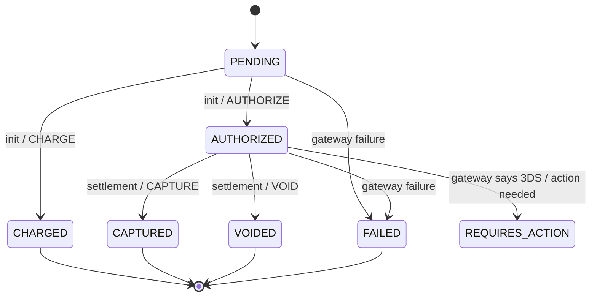
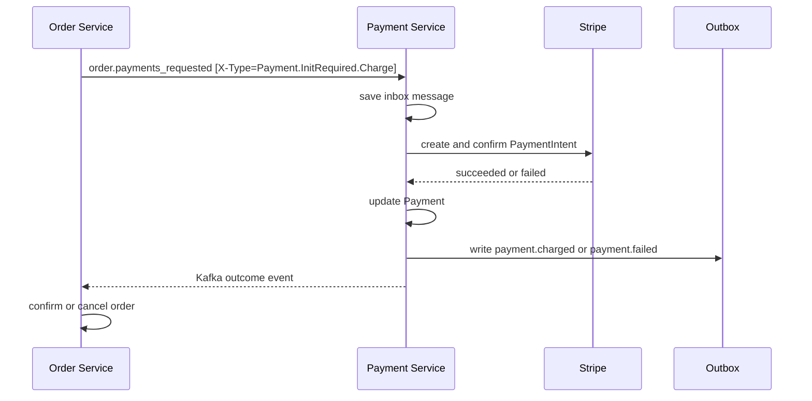
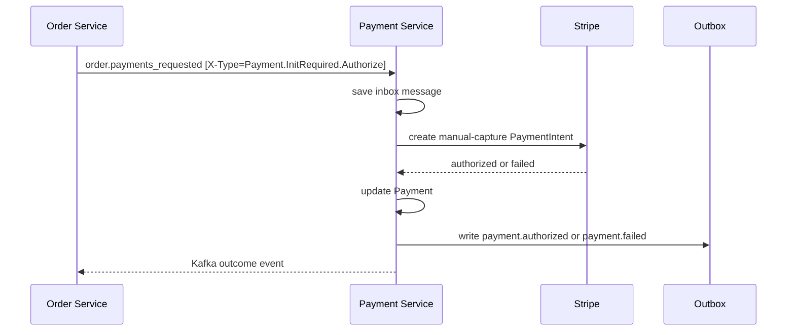
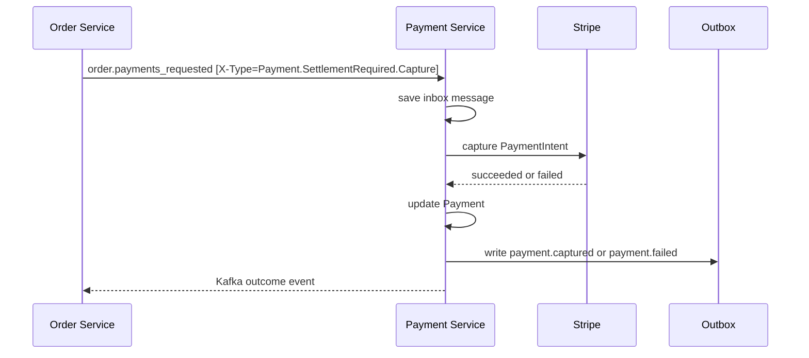
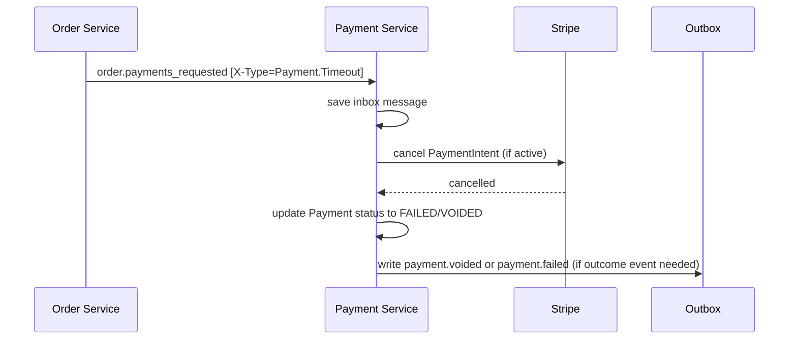
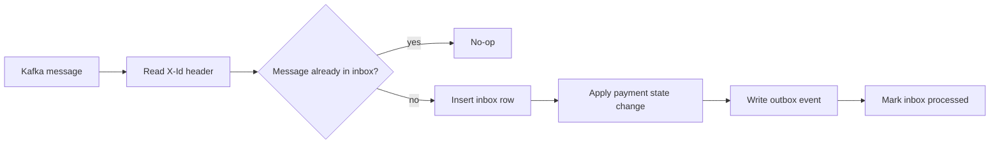
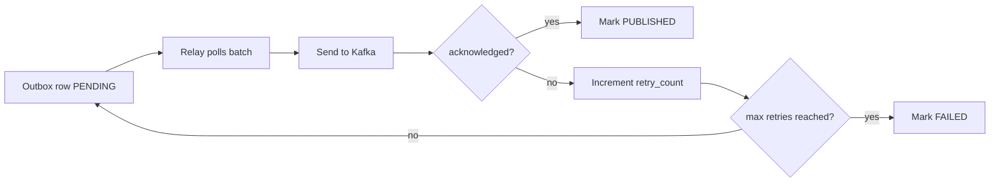

# Payment Service — Data Model, Broker Contracts & Workflow

This document describes the payment-service contract for Rally in the same style as `order-service-details.md`.

It focuses on the broker-driven payment flow:

- Order Service publishes payment requests.
- Payment Service consumes those requests.
- Payment Service persists state in PostgreSQL.
- Payment Service uses inbox/outbox tables for reliability.
- Payment Service publishes payment outcome events back to Kafka.

The selected integration model is:

- `order.payments_requested` for the first step.

The payment service does not need to be called directly by Order over HTTP for the main checkout flow.

---

## 1. Payment DB Schema

```sql
CREATE EXTENSION IF NOT EXISTS pgcrypto;

-- =====================================================================
-- payment_methods
-- =====================================================================

CREATE TABLE payment_methods (
    id               UUID PRIMARY KEY DEFAULT gen_random_uuid(),
    user_id          UUID NOT NULL,
    type             VARCHAR(50) NOT NULL,     -- CARD, WALLET, etc.
    token            VARCHAR(500) NOT NULL,    -- Stripe payment method id or vault token
    is_default       BOOLEAN NOT NULL DEFAULT FALSE,
    card_brand       VARCHAR(50),
    card_last4       VARCHAR(4),
    card_exp_month   VARCHAR(2),
    card_exp_year    VARCHAR(4),
    version          BIGINT NOT NULL DEFAULT 0,
    created_at       TIMESTAMPTZ NOT NULL DEFAULT now(),
    updated_at       TIMESTAMPTZ NOT NULL DEFAULT now()
);

CREATE INDEX idx_payment_methods_user_id ON payment_methods (user_id);

-- Optional but recommended if a token must not be duplicated per user.
CREATE UNIQUE INDEX uq_payment_methods_user_token
    ON payment_methods (user_id, token);

-- Only one default payment method per user.
CREATE UNIQUE INDEX uq_payment_methods_one_default_per_user
    ON payment_methods (user_id)
    WHERE is_default = TRUE;

-- =====================================================================
-- payments
-- =====================================================================

CREATE TABLE payments (
    id                 UUID PRIMARY KEY DEFAULT gen_random_uuid(),
    user_id            UUID NOT NULL,
    order_id           UUID NOT NULL,
    payment_method_id  UUID NOT NULL REFERENCES payment_methods(id),
    payment_intent_id  VARCHAR(255),
    stripe_customer_id VARCHAR(255),
    amount             NUMERIC(18,2) NOT NULL CHECK (amount >= 0),
    status             VARCHAR(50) NOT NULL,
    failure_reason     VARCHAR(500),
    created_at         TIMESTAMPTZ NOT NULL DEFAULT now(),
    authorized_at      TIMESTAMPTZ,
    captured_at        TIMESTAMPTZ,
    charged_at         TIMESTAMPTZ,
    failed_at          TIMESTAMPTZ,
    voided_at          TIMESTAMPTZ,
    updated_at         TIMESTAMPTZ NOT NULL DEFAULT now(),
    version            BIGINT NOT NULL DEFAULT 0
);

CREATE UNIQUE INDEX uq_payments_order_id ON payments (order_id);
CREATE INDEX idx_payments_user_id ON payments (user_id);
CREATE INDEX idx_payments_payment_method_id ON payments (payment_method_id);
CREATE INDEX idx_payments_payment_intent_id ON payments (payment_intent_id);
CREATE INDEX idx_payments_status ON payments (status);

-- =====================================================================
-- inbox_messages
-- =====================================================================

CREATE TABLE inbox_messages (
    message_id      VARCHAR(255) PRIMARY KEY, -- stripe event id or kafka message id
    topic           VARCHAR(100) NOT NULL,    -- stripe.events / order / etc.
    message_type    VARCHAR(100) NOT NULL,    -- payment_intent.created / Payment.InitRequired / etc.
    correlation_id  UUID,
    causation_id    VARCHAR(255),
    trace_id        VARCHAR(64),
    payload         JSONB NOT NULL,
    headers         JSONB,
    status          VARCHAR(20) NOT NULL DEFAULT 'RECEIVED',
    retry_count     INTEGER NOT NULL DEFAULT 0,
    max_retries     INTEGER NOT NULL DEFAULT 5,
    received_at     TIMESTAMPTZ NOT NULL DEFAULT now(),
    processed_at    TIMESTAMPTZ,
    last_error      TEXT
);

CREATE INDEX idx_inbox_status_received_at
    ON inbox_messages (status, received_at);

CREATE INDEX idx_inbox_topic
    ON inbox_messages (topic);

CREATE INDEX idx_inbox_correlation
    ON inbox_messages (correlation_id);

-- =====================================================================
-- outbox_messages
-- =====================================================================

CREATE TABLE outbox_messages (
    message_id      UUID PRIMARY KEY,
    aggregate_id    UUID NOT NULL,
    aggregate_type  VARCHAR(100) NOT NULL,
    topic           VARCHAR(100) NOT NULL,
    message_key     VARCHAR(255), -- not used yet; single partition setup
    message_type    VARCHAR(100) NOT NULL,
    correlation_id  UUID,
    causation_id    VARCHAR(255),
    trace_id        VARCHAR(64),
    payload         JSONB NOT NULL,
    headers         JSONB,
    status          VARCHAR(20) NOT NULL DEFAULT 'PENDING',
    retry_count     INTEGER NOT NULL DEFAULT 0,
    max_retries     INTEGER NOT NULL DEFAULT 5,
    created_at      TIMESTAMPTZ NOT NULL DEFAULT now(),
    published_at    TIMESTAMPTZ,
    last_error      TEXT
);

CREATE INDEX idx_outbox_status_created_at
    ON outbox_messages (status, created_at);

CREATE INDEX idx_outbox_topic
    ON outbox_messages (topic);

CREATE INDEX idx_outbox_aggregate
    ON outbox_messages (aggregate_id);

CREATE INDEX idx_outbox_correlation
    ON outbox_messages (correlation_id);
```

---

## 2. Payment Domain Model

### 2.1 `Payment`

The `Payment` aggregate owns the lifecycle of a payment for a single order.

Key fields:

- `id`
- `userId`
- `orderId`
- `paymentMethodId`
- `paymentIntentId`
- `stripeCustomerId`
- `amount`
- `status`
- `failureReason`
- timestamps for key transitions
- optimistic locking `version`

Key behaviors:

- `initialize(...)`
- `charge(...)`
- `authorize(...)`
- `capture()`
- `voidPayment(...)`
- `fail(...)`
- `requireAdditionalAction(...)`

### 2.2 `PaymentMethod`

Represents a buyer-owned payment method.

Key fields:

- `id`
- `userId`
- `type`
- `token`
- `isDefault`
- embedded card metadata
- `version`

The service stores only non-sensitive metadata such as brand and last four digits.

### 2.3 `InboxMessage`

Stores consumed broker messages for idempotency and retry tracking.

### 2.4 `OutboxMessage`

Stores payment outcome events that will later be published to Kafka by the outbox relay.

---

## 3. Payment Status Machine



Practical meaning:

- `PENDING` means the payment has been created locally but is not yet resolved.
- `AUTHORIZED` means the card is held and ready for settlement.
- `CHARGED` means immediate purchase succeeded.
- `CAPTURED` means a previously authorized payment has been settled.
- `VOIDED` means a held payment was cancelled before capture.
- `FAILED` means the payment attempt did not complete successfully.
- `REQUIRES_ACTION` means customer action is required before completion.

---

## 4. Kafka Topic Contracts

The order service publishes payment requests. The payment service consumes those requests and publishes outcome events.

### 4.1 Message envelope rule

Every brokered message, whether consumed or published, must include these headers:

| Header | Required | Purpose |
|---|---|---|
| `X-Id` | yes | Unique message identifier used for inbox/outbox dedupe |
| `X-Type` | yes | Message type and operation selector |
| `X-Correlation-Id` | yes | Links the message to the business flow |
| `X-Causation-Id` | yes | Points to the message that triggered this one |
| `X-Trace-Id` | yes | Distributed tracing identifier |

The payload must not contain any of those fields.

For payment requests and payment outcome events, the operation or message type must be selected by `X-Type`, not by a payload field.

The payload must never carry `status` or any enum value in either inbound or outbound messages.

Recommended `X-Type` values for request messages:

- `Payment.InitRequired.Charge`
- `Payment.InitRequired.Authorize`
- `Payment.SettlementRequired.Capture`
- `Payment.SettlementRequired.Void`
- `Payment.Timeout`

Recommended `X-Type` values for outcome messages:

- `Payment.Authorized`
- `Payment.Charged`
- `Payment.Captured`
- `Payment.Failed`
- `Payment.Voided`
- `Payment.RequiresAction`

### 4.2 Order Service -> Payment Service

| Topic | Purpose | `X-Type` selector |
|---|---|---|
| `order.payments_requested` | First step of checkout | `X-Type = Payment.InitRequired.Charge` or `Payment.InitRequired.Authorize` |
| `order.payments_requested` | Final settlement step | `X-Type = Payment.SettlementRequired.Capture` or `Payment.SettlementRequired.Void` |
| `order.payments_requested` | Order timed out and payment must be cancelled | `X-Type = Payment.Timeout` |

### 4.3 Payment Service -> Order Service

| Topic | Purpose |
|---|---|
| `payment.events` | Payment outcome events consumed by Order Service |

---

## 5. Message Payload Schemas

### 5.1 Payment Initiation Requested

The order service sends this when a payment should start.

Headers:

| Header | Example |
|---|---|
| `X-Type` | `Payment.InitRequired.Charge` or `Payment.InitRequired.Authorize` |
| `X-Id` | `uuid` |
| `X-Correlation-Id` | `uuid` |
| `X-Causation-Id` | `uuid` of the order event that triggered the request |
| `X-Trace-Id` | tracing id |

Payload:

```json
{
  "userId": "uuid",
  "orderId": "uuid",
  "paymentMethodId": "uuid",
  "amount": 125.50
}
```

This payload intentionally contains no `status` or enum field.

Interpretation:

- `X-Type = Payment.InitRequired.Charge` for normal purchase
- `X-Type = Payment.InitRequired.Authorize` for deal participation or delayed settlement flows

### 5.2 Payment Settlement Requested

The order service sends this when a resolved payment must be finalized.

Headers:

| Header | Example |
|---|---|
| `X-Type` | `Payment.SettlementRequired.Capture` or `Payment.SettlementRequired.Void` |
| `X-Id` | `uuid` |
| `X-Correlation-Id` | `uuid` |
| `X-Causation-Id` | `uuid` of the order event that triggered the request |
| `X-Trace-Id` | tracing id |

Payload:

```json
{
  "paymentId": "uuid",
  "orderId": "uuid"
}
```

This payload intentionally contains no `status` or enum field.

Interpretation:

- `X-Type = Payment.SettlementRequired.Capture`
- `X-Type = Payment.SettlementRequired.Void`

### 5.3 Payment Timeout Received

The order service sends this when the order has timed out and the payment service must cancel the payment for that order.

Headers:

| Header | Example |
|---|---|
| `X-Type` | `Payment.Timeout` |
| `X-Id` | `uuid` |
| `X-Correlation-Id` | `uuid` |
| `X-Causation-Id` | `uuid` of the order event that triggered the timeout |
| `X-Trace-Id` | tracing id |

Payload:

```json
{
  "orderId": "uuid"
}
```

This payload intentionally contains no `status` or enum field.

Interpretation:

- `X-Type = Payment.Timeout` means the payment service must cancel the payment / Stripe PaymentIntent for the specified `orderId`.

### 5.4 Payment Outcome Events

#### `payment.authorized`

Headers:

| Header | Example |
|---|---|
| `X-Type` | `Payment.Authorized` |
| `X-Id` | `uuid` |
| `X-Correlation-Id` | `uuid` |
| `X-Causation-Id` | `uuid` of the triggering request or webhook |
| `X-Trace-Id` | tracing id |

Payload:

```json
{
  "paymentId": "uuid",
  "orderId": "uuid",
  "paymentIntentId": "pi_...",
  "amount": 125.50,
}
```

`X-Type` declares the message type; the payload does not carry a `status` or enum.

#### `payment.charged`

Headers:

| Header | Example |
|---|---|
| `X-Type` | `Payment.Charged` |
| `X-Id` | `uuid` |
| `X-Correlation-Id` | `uuid` |
| `X-Causation-Id` | `uuid` of the triggering request or webhook |
| `X-Trace-Id` | tracing id |

Payload:

```json
{
  "paymentId": "uuid",
  "orderId": "uuid",
  "paymentIntentId": "pi_...",
  "amount": 125.50,
}
```

`X-Type` declares the message type; the payload does not carry a `status` or enum.

#### `payment.captured`

Headers:

| Header | Example |
|---|---|
| `X-Type` | `Payment.Captured` |
| `X-Id` | `uuid` |
| `X-Correlation-Id` | `uuid` |
| `X-Causation-Id` | `uuid` of the triggering request or webhook |
| `X-Trace-Id` | tracing id |

Payload:

```json
{
  "paymentId": "uuid",
  "orderId": "uuid",
  "paymentIntentId": "pi_...",
  "amount": 125.50,
}
```

`X-Type` declares the message type; the payload does not carry a `status` or enum.

#### `payment.failed`

Headers:

| Header | Example |
|---|---|
| `X-Type` | `Payment.Failed` |
| `X-Id` | `uuid` |
| `X-Correlation-Id` | `uuid` |
| `X-Causation-Id` | `uuid` of the triggering request or webhook |
| `X-Trace-Id` | tracing id |

Payload:

```json
{
  "paymentId": "uuid",
  "orderId": "uuid",
  "paymentIntentId": "pi_...",
  "amount": 125.50,
  "errorCode": "card_declined",
  "errorMessage": "The card was declined"
}
```

#### `payment.voided`

Headers:

| Header | Example |
|---|---|
| `X-Type` | `Payment.Voided` |
| `X-Id` | `uuid` |
| `X-Correlation-Id` | `uuid` |
| `X-Causation-Id` | `uuid` of the triggering request or webhook |
| `X-Trace-Id` | tracing id |

Payload:

```json
{
  "paymentId": "uuid",
  "orderId": "uuid",
  "paymentIntentId": "pi_...",
  "amount": 125.50,
}
```

`X-Type` declares the message type; the payload does not carry a `status` or enum.

#### `payment.requires_action`

Headers:

| Header | Example |
|---|---|
| `X-Type` | `Payment.RequiresAction` |
| `X-Id` | `uuid` |
| `X-Correlation-Id` | `uuid` |
| `X-Causation-Id` | `uuid` of the triggering request or webhook |
| `X-Trace-Id` | tracing id |

Payload:

```json
{
  "paymentId": "uuid",
  "orderId": "uuid",
  "paymentIntentId": "pi_...",
  "amount": 125.50,
}
```

`X-Type` declares the message type; the payload does not carry a `status` or enum.

### 5.5 Required Headers

| Header | Purpose |
|---|---|
| `X-Id` | Unique message id for inbox/outbox dedupe |
| `X-Type` | Event or command type |
| `X-Correlation-Id` | Correlates payment request with the order flow |
| `X-Causation-Id` | Optional, points to the triggering message id |
| `X-Trace-Id` | Optional distributed-tracing identifier |

The inbox/outbox persistence model mirrors these headers:

- `message_id` stores `X-Id`
- `correlation_id` stores `X-Correlation-Id`
- `causation_id` stores `X-Causation-Id`
- `trace_id` stores `X-Trace-Id`

### 5.5 Payload rule

The payload for every message must contain only business data.

The payload must not contain:

- message id
- correlation id
- causation id
- trace id
- type

Those belong only in headers.

---

## 6. Flows

### 6.1 Normal Purchase



Typical sequence:

1. Order Service creates the order and publishes `order.payments_requested` with `X-Type=Payment.InitRequired.Charge`.
2. Payment Service stores the message in the inbox table.
3. Payment Service loads the payment method and creates the Stripe PaymentIntent.
4. If Stripe confirms the payment, Payment Service marks the payment as `CHARGED`.
5. Payment Service writes `payment.charged` to the outbox.
6. Order Service consumes `payment.charged` and confirms the order.

If Stripe declines:

1. Payment Service marks the payment `FAILED`.
2. Payment Service writes `payment.failed` to the outbox.
3. Order Service cancels the order and releases inventory.

### 6.2 Deal Authorization



Typical sequence:

1. Order Service creates a deal order in pending authorization state.
2. It publishes `order.payments_requested` with `X-Type=Payment.InitRequired.Authorize`.
3. Payment Service authorizes the amount with Stripe.
4. Payment Service publishes `payment.authorized`.
5. Order Service moves the order to `AUTHORIZED`.

### 6.3 Deal Settlement



For void:

1. Order Service publishes `order.payments_requested` with `X-Type=Payment.SettlementRequired.Void`.
2. Payment Service cancels the authorized intent.
3. Payment Service publishes `payment.voided`.
4. Order Service cancels the order.

### 6.4 Payment Timeout Flow



Typical sequence:

1. Order Service's reconciliation sweeper identifies an order stuck in `pending_charge` (> 5 min) or `pending_authorization` (> 60s).
2. Order Service publishes an event to `order.payments_requested` with header `X-Type = Payment.Timeout` and payload `{ "orderId": "uuid" }`.
3. Payment Service receives the message and persists it in `inbox_messages` for deduplication.
4. Payment Service looks up the payment for `orderId`. If a Stripe PaymentIntent exists and is active, Payment Service cancels it with Stripe.
5. Payment Service updates the local payment status to `VOIDED` or `FAILED`.

### 6.5 Inbox Reliability



Rules:

- A message is processed at most once per `X-Id`.
- Duplicate redelivery must be a no-op.
- Payment state changes and outbox writes happen in the same transaction.
- Inbox and outbox entries must preserve the header envelope fields.

### 6.6 Outbox Relay



---

## 7. API Surface

The broker-driven flow is the primary path, but the service still exposes supporting APIs for setup, inspection, replay, and operational safety.

### 7.1 Payment Methods

| Method | Path | Purpose |
|---|---|---|
| `POST` | `/api/payment-methods` | Save a buyer payment method or setup-intent result |
| `GET` | `/api/payment-methods` | List buyer payment methods |
| `GET` | `/api/payment-methods/{id}` | Get one payment method |
| `PATCH` | `/api/payment-methods/{id}/default` | Mark one payment method as the default method |
| `DELETE` | `/api/payment-methods/{id}` | Remove a saved payment method |
### 7.2 Payment Status

| Method | Path | Purpose |
|---|---|---|
| `GET` | `/api/payments/{id}` | Inspect payment state |
| `GET` | `/api/payments/order/{orderId}` | Inspect payment(s) by order |
| `GET` | `/api/payments/user/{userId}` | Inspect payments for a user |
| `GET` | `/api/payments/status/{status}` | Search payments by lifecycle status |
| `POST` | `/api/payments/{id}/authorize` | Internal or operator-assisted authorization |
| `POST` | `/api/payments/{id}/capture` | Internal or operator-assisted settlement capture |
| `POST` | `/api/payments/{id}/void` | Internal or operator-assisted void |
| `POST` | `/api/payments/{id}/fail` | Internal recovery endpoint to mark a payment failed |
| `POST` | `/api/payments/{id}/refund` | Optional refund flow if refund support is enabled |

### 7.3 Broker Intake

| Method | Path | Purpose |
|---|---|---|
| `POST` | `/api/webhooks/stripe` | Verify Stripe signatures and ingest webhook events |
| `POST` | `/api/internal/messages/replay` | Replay a stored inbox message under operator control |
| `POST` | `/api/internal/outbox/{id}/republish` | Republish one outbox record after inspection |
| `POST` | `/api/internal/outbox/retry` | Retry a batch of failed outbox records |

### 7.4 Reliability and Ops

| Method | Path | Purpose |
|---|---|---|
| `GET` | `/actuator/health` | Application and dependency health |
| `GET` | `/actuator/info` | Build and deployment metadata |
| `GET` | `/actuator/metrics` | Runtime metrics |
| `GET` | `/actuator/prometheus` | Prometheus scrape endpoint |
| `GET` | `/actuator/loggers` | Logging diagnostics if enabled |

### 7.5 Optional diagnostics

| Method | Path | Purpose |
|---|---|---|
| `GET` | `/api/internal/inbox` | Inspect inbox rows for support/debugging |
| `GET` | `/api/internal/inbox/failed` | List failed inbox rows |
| `GET` | `/api/internal/outbox` | Inspect outbox rows for support/debugging |
| `GET` | `/api/internal/outbox/pending` | List pending outbox rows |

---

## 8. Payment Service Responsibilities

The payment service owns:

- payment method persistence
- payment state transitions
- inbox deduplication
- outbox publishing
- Stripe interaction
- payment outcome publication to Order Service

The payment service does not own:

- order state transitions
- inventory reservation
- deal lifecycle rules
- user-facing checkout orchestration

---

## 9. Notes on Naming

For Rally, keep the contract names aligned with Order Service.

### Topic Names

- `order.payments_requested`
- `payment.events`

### Inbound Message `X-Type` Values

- `Payment.InitRequired.Charge`
- `Payment.InitRequired.Authorize`
- `Payment.SettlementRequired.Capture`
- `Payment.SettlementRequired.Void`
- `Payment.Timeout`


### Outbound Message `X-Type` Values

- `Payment.Authorized`
- `Payment.Charged`
- `Payment.Captured`
- `Payment.Failed`
- `Payment.Voided`
- `Payment.RequiresAction`

Keep topic names lowercase and domain-oriented. Keep `X-Type` values as the message contract identifiers, and keep enum casing only in code-level models where needed.

---

## 10. Summary

The payment service is a broker-driven, Stripe-backed, inbox/outbox protected microservice.

Its job is to:

1. receive payment commands from Order,
2. resolve them against Stripe,
3. store the outcome safely,
4. publish canonical payment events,
5. and let Order finish the checkout lifecycle.
