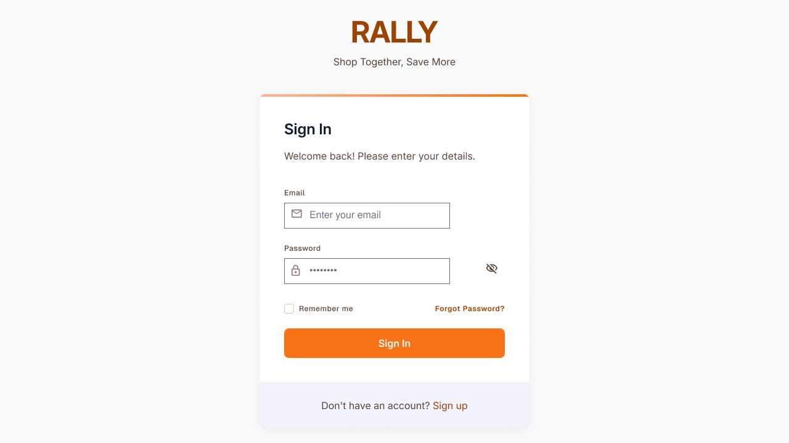
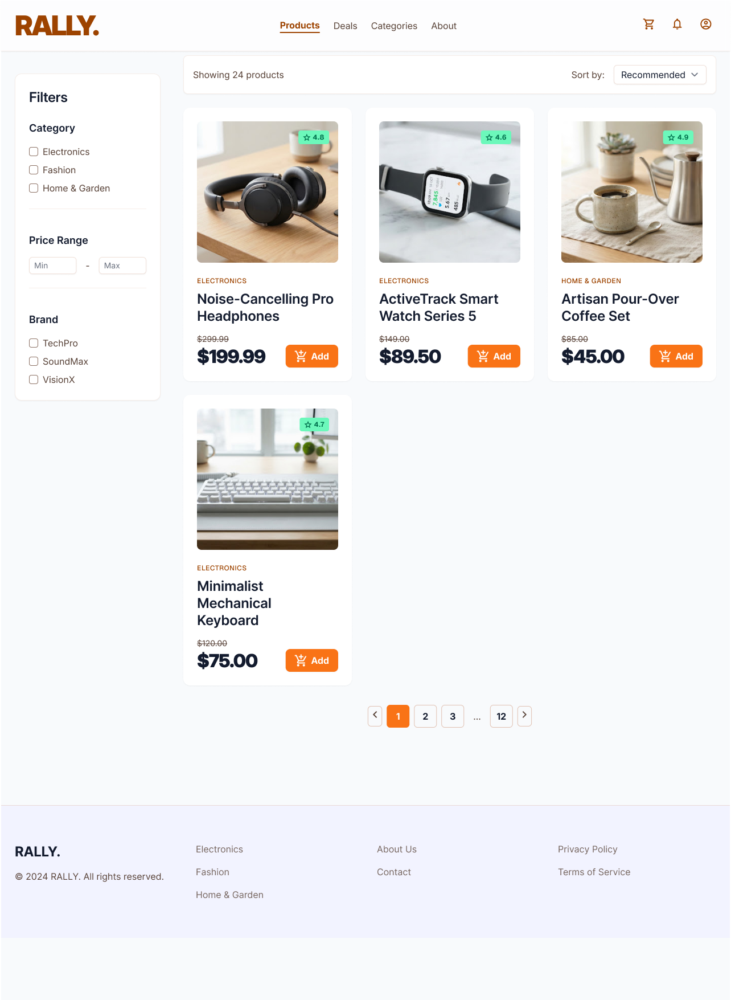

# Wireframes

Low-fidelity wireframes for the GroupDeal platform, organized by user flow. Source images
live in [`assets/wireframes/`](assets/wireframes/).

---

## Auth

### Login

### Register

---

## Public / Buyer Browsing

### Landing Page

### About GroupDeal

### Contact Us

### Products

### Product Details

### Browse Group Deals

### Deal Details
Shows the shared participant pool, stock cap, and countdown timer for a single deal.

---

## Buyer Checkout & Account

### Create Group Deal
Buyer-initiated flow to start a new group deal on a product.

### Shopping Cart

### Order Details - Standard Order
Order confirmation for a normal, non-group purchase at base price.

### Order Details - Group Deal (Aligned)
Order confirmation once a group deal has succeeded and holds are captured.

### User Profile

---

## Seller Flow

### Seller Dashboard

### Product Management

### Add New Product

### Manage Group Deals
Seller view for tracking deal-level stock cap, participant count, and timer status.

